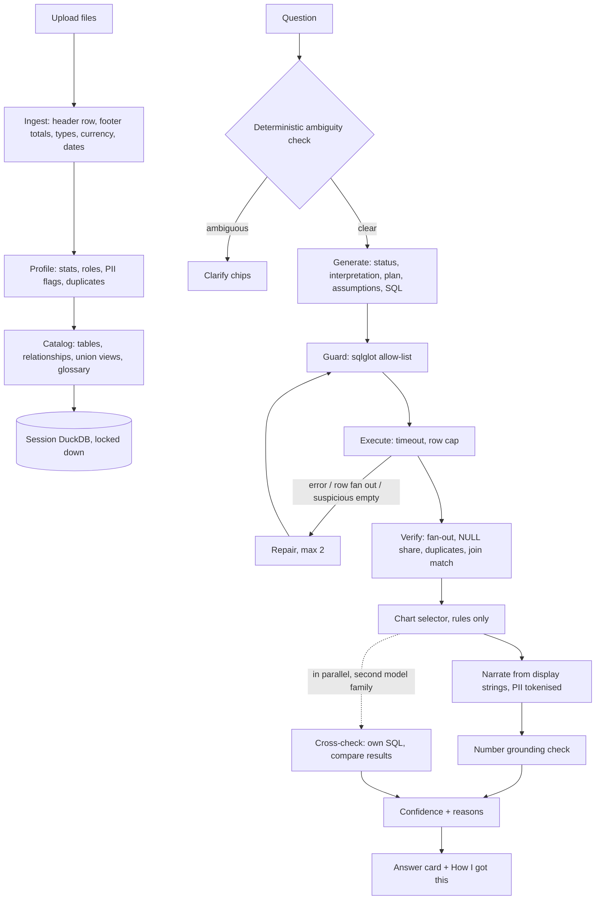

# Verity

Verity is a small web app: upload one or more CSV or Excel files, ask a question in plain English,
and get an answer with a chart, a confidence level with its reasons, and a "How I got this" panel
showing the SQL, the data it touched and the exact prompts the model was sent. It was built as a
take-home for a Forward Deployed Engineer role, with messy Indian HR exports as the worked example;
nothing in the engine is specific to HR, and the sample data includes a sales file to show it.

_Screenshot: <!-- SCREENSHOT --> the lead replaces this line with the image._

- Hosted demo: <!-- DEPLOY_URL --> _added by the lead after the first deploy_
- One-page write-up: [`WRITEUP.md`](WRITEUP.md) · three-minute walkthrough: [`DEMO_SCRIPT.md`](DEMO_SCRIPT.md)

> **The one rule.** The model never computes a number and never sees a row. It turns the question
> into SQL. DuckDB computes the result. Ordinary deterministic code checks the SQL before it runs
> and the answer after. The screen shows the work.

## Architecture



One container runs everything: FastAPI serves the API and the built React app. Each browser
session gets its own in-memory DuckDB with file access, network access and configuration changes
switched off. Sessions live in process memory (20 at most, dropped after 2 idle hours) and are gone
on restart. Raw uploads are deleted as soon as they are loaded. The model is called at most four
ways per question: write SQL, repair it (at most twice), write SQL again independently for the
cross-check, and phrase the computed result. Reasoning is in [`docs/DESIGN.md`](docs/DESIGN.md).

## The delta: what is added on top of a raw model call

The baseline is "paste the spreadsheet into a chat model". Each row is something an engineer adds
so a customer can trust the answer on their real data.

| Layer | What it adds | Why | Where |
|---|---|---|---|
| Ingestion receipt | Finds the real header row, drops "Grand Total" footers, parses `₹1,20,000`, lakh and crore amounts and day-first dates, keeps `000457` as text, and reports every change per file | Wrong answers on real exports usually start here, silently | `backend/app/ingest` |
| Rows never reach the model | The model that writes SQL sees column names, types, statistics and short category labels, never a row. PII columns (name, email, phone, PAN, Aadhaar, UAN, bank account, IFSC) contribute no values. The model that phrases the answer sees only the top of the *computed result* (30 rows, 12 columns), with PII replaced by tokens and free text hidden. "What the model saw" shows the exact prompts | HR data cannot go to a third-party model. A test plants fake PII and fails if it appears in any prompt | `backend/app/catalog/prompt_context.py`, `backend/app/profile/pii.py`, `backend/app/query/narrator.py` |
| Cross-file links | Finds that `emp_id` in one file is `Emp Code` in another, with match % and cardinality; stacks same-shaped files (`attendance_q1`, `attendance_q2`) into one view. The user can confirm or reject each | Cross-file questions work without anyone writing a join, and a bad link is visible | `backend/app/catalog` |
| HR glossary | Ten vetted, editable definitions (headcount, attrition rate, LOP % and others). "Salary" with CTC, gross and net all present produces one-click options, by rule, with no model call | One word must mean one thing, per customer | `backend/app/catalog/glossary.py` |
| SQL guard | The model's SQL is parsed and must be one read-only `SELECT` over tables and columns in the session. Allow-list, not deny-list. The SQL that runs is re-rendered from the parsed tree | Hostile questions and hostile cell text cannot make the database do anything else | `backend/app/query/guard.py` |
| Silent-error checks | Detects joins that multiply rows (and asks for one repair), reports the share of empty values behind a number, duplicate rows, and keys with no match across a join, naming the side | These produce confident, plausible, wrong totals | `backend/app/query/verify.py`, `pipeline.py` |
| Cross-check | A second model from a different family writes its own SQL; the two result sets are compared | Agreement is the best available signal that the question was read correctly. It feeds confidence; it is not a vote | `backend/app/query/pipeline.py` |
| Grounded wording | The model phrases the answer from pre-formatted numbers (`₹12.4 L`). A number in its sentence that is not in the result is rejected; after one retry a plain template is used | The model cannot invent or re-round a figure | `backend/app/query/narrator.py` |
| Confidence with reasons | High, Medium or Low from listed signals: repairs, cross-check, empty values, join match, fan-out, template fallback, vetted definition | The analyst knows when to double-check | `backend/app/query/confidence.py` |
| Honest refusal | If the data cannot answer, it says so and names what is missing | No answer beats a wrong one | `backend/app/query/generator.py` |
| Measured correctness | 40 golden questions, truth computed independently of the app, a holdout split, and a Trust Report page in the app | The accuracy claim is a number anyone can re-run | `eval/` |

## Quick start

Verity needs one free API key to answer questions. A Groq key takes a minute and no card:
<https://console.groq.com/keys>. Without any key the app still starts and loads the sample data,
so you can read the ingestion receipts and detected links; asking then replies "No AI model is
configured".

### With Docker (recommended)

Needs Docker Desktop, or Docker Engine with Compose 2.24 or newer (`docker compose version`).

```bash
git clone <repo-url> verity && cd verity
cp .env.example .env        # then open .env and paste your key after GROQ_API_KEY=
docker compose up --build   # or: make up
```

Open <http://localhost:8000>, click **Try with sample HR data**, then click a suggested question.
The first build takes a few minutes. After changing `.env`, stop with Ctrl-C and run the last
command again. The container runs as uid 1000 on a read-only filesystem with an in-memory `/tmp`.

### Local development

Needs [uv](https://docs.astral.sh/uv/) (it fetches Python 3.12 if you lack it), Node 22 or newer,
and pnpm 10.

```bash
make setup    # uv sync, pnpm install, and creates .env from .env.example if there is none
              # then open .env and paste your key after GROQ_API_KEY=
make dev      # API with reload on :8000, UI on :5173
```

Open <http://localhost:5173> (not :8000, which serves the UI only after `pnpm build`). Ctrl-C stops
both. To work on the UI with no backend and no key: `cd frontend && VITE_MOCK=1 pnpm dev`.

| Command | What it does |
|---|---|
| `make` | Lists the commands |
| `make setup` | Installs backend and frontend dependencies; creates `.env` if missing |
| `make dev` | API and UI with live reload |
| `make test` | Backend tests, packaging checks and the frontend type check. Never calls a model |
| `make eval` | Grades the app on the golden questions with the real model, for example `make eval ARGS="--split dev"` |
| `make fixtures` | Regenerates the UI's mock data after a change to `backend/app/contracts.py` |
| `make build` / `make up` | Builds the image / runs it with Docker Compose on :8000 |
| `make smoke` | Builds the image and starts it locked down with `PORT` set as a host would; checks `/healthz`, that the UI is served, uid 1000, and that no `.env`, key file, `.git`, `node_modules` or `.playwright-mcp` is inside |
| `make warm URL=...` | Wakes a deployed app and pre-answers the starter questions |

## Deploy in 5 minutes

About five minutes of clicking; Render's first build then takes several more. [`render.yaml`](render.yaml)
describes one Docker web service on the **free** plan with health check `/healthz`,
`MAX_UPLOAD_MB=10`, `DUCKDB_MEMORY_LIMIT=256MB` and `DUCKDB_THREADS=2` (the instance has 512 MB
and 0.1 CPU). No file needs editing and no secret is in git.

1. Push this repository to your GitHub account.
2. Go to <https://dashboard.render.com> and sign in with GitHub.
3. Click **New +**, then **Blueprint**.
4. If your repositories are not listed, click **Connect GitHub** and give Render access to this
   one. Click **Connect** next to the repository.
5. Blueprint name: `verity`. Branch: `main`. Leave the Blueprint path as `render.yaml`.
6. Render lists one service, `verity`, and asks for the four API keys marked `sync: false`. Paste
   `GROQ_API_KEY`; fill in the others only if you have them. One key is enough: the app treats a
   missing or empty key as "skip this provider". Keys can be added or changed later under the
   service's **Environment** tab.
7. Click **Deploy Blueprint**. When the service shows **Live**, copy its URL from the top of the
   service page (`https://verity.onrender.com`, or with a suffix if the name is taken) and open
   `<url>/healthz`: it replies `{"status":"ok"}`.
8. Keep it awake. In GitHub open **Settings > Secrets and variables > Actions > Variables > New
   repository variable**, name `APP_URL`, value the URL from step 7.
   [`keepwarm.yml`](.github/workflows/keepwarm.yml) then pings `/healthz` every 10 minutes. While
   `APP_URL` is unset the job is skipped, not failed. GitHub can run scheduled jobs late, so also
   point a free uptime monitor at the same address.
9. From your machine: `make warm URL=<url>`. It loads the sample data and asks the six starter
   questions, so the first visitor gets cached answers. Run it after every deploy, because the
   cache is in process memory.

Every push to the branch redeploys. The free instance sleeps after 15 idle minutes and takes
about a minute to wake; steps 8 and 9 are the mitigation. The image is host-agnostic (it listens
on `$PORT` and needs only environment variables), so any Docker host works.

## Configuration

Every setting is an environment variable, listed with its default in [`.env.example`](.env.example).
A variable left empty counts as unset. A test fails if `config.py` reads a variable that
`.env.example` does not list.

### Provider failover chains

Verity talks to any OpenAI-compatible endpoint and runs on free tiers, so reliability comes from
**chains**: an ordered, comma-separated list of `provider:model`. Providers with no key are
skipped. If a provider is rate-limited, down, slow (30 s) or rejects the request, the next entry is
tried; if all fail and one said "retry in under 10 seconds", that one is retried once. The answer
records which provider and model wrote it. Temperature is 0.

| Job | Variable | Default first choice |
|---|---|---|
| Write the SQL | `LLM_SQL_CHAIN` | `groq:openai/gpt-oss-120b` |
| Write SQL independently for the cross-check | `LLM_CROSSCHECK_CHAIN` | `groq:qwen/qwen3.8-27b` |
| Phrase the answer from computed numbers | `LLM_NARRATE_CHAIN` | `groq:openai/gpt-oss-20b` |

The full default chains are in `.env.example` (a test keeps them equal to `config.py`). Keep the
cross-check on a different model family from the SQL model, or agreement means little.
`CROSSCHECK=off` halves model usage and removes the "Cross-checked" badge. Groq's free limits are
per model, so a chain that alternates models spreads the quota.

Providers: `groq`, `nvidia` (NIM), `gemini` (Google AI Studio), `openrouter`, `ollama`, and
`custom` for any other base URL such as a customer's gateway: set `LLM_BASE_URL`, then use
`custom:<model>` in a chain. `LLM_API_KEY` is optional there, because a gateway or a self-hosted
vLLM server often authenticates by network; `LLM_BASE_URL` alone makes the entry real. Every
other provider is skipped when its key is missing or blank, rather than spending a call on a 401.

**Every runtime model is open-weight.** `openai/gpt-oss-120b` and `openai/gpt-oss-20b` are OpenAI's
**Apache-2.0 open-weight** models, and `qwen/qwen3.8-27b` is Alibaba's Apache-2.0 open-weight
model. Both are served here by Groq. This is not the GPT API and no request goes to OpenAI. The
fallbacks are DeepSeek (MIT) and Gemma (Apache-2.0).

### Fully local, for air-gapped customers

With [Ollama](https://ollama.com) no request leaves the machine and no key is needed:

```bash
ollama pull gpt-oss:20b
```

```bash
# .env
LLM_SQL_CHAIN=ollama:gpt-oss:20b
LLM_NARRATE_CHAIN=ollama:gpt-oss:20b
CROSSCHECK=off
# only when Verity itself runs in Docker (Compose maps this name to the host, on Linux too):
OLLAMA_BASE_URL=http://host.docker.internal:11434/v1
```

To keep the cross-check, pull a second model family and set `LLM_CROSSCHECK_CHAIN` to it instead of
turning `CROSSCHECK` off. This path was checked at the configuration level only (the chain resolves
to the Ollama endpoint with no key); it was not run against a local model on the build machine.

### Limits

`MAX_UPLOAD_MB` (25), `QUERY_TIMEOUT_S` (10), `ROW_CAP` (5000), `DUCKDB_MEMORY_LIMIT` (512MB),
`DUCKDB_THREADS` (2), `SESSION_TTL_S` (7200), `MAX_SESSIONS` (20), `ASKS_PER_IP_PER_HOUR` (60),
`LLM_CALLS_PER_DAY` (3000). Fixed in code: 10 files per upload, 30 tables per session.

## Tech stack

- **Backend:** Python 3.12, FastAPI, DuckDB 1.5, pandas 3, openpyxl, sqlglot, Pydantic 2, and the `openai` client pointed at OpenAI-compatible endpoints. Managed with uv.
- **Frontend:** React 19, Vite, TypeScript, Tailwind 4, Recharts. No state library, no router, no component kit.
- **Packaging:** one two-stage Dockerfile (Node builds the UI, Python runs everything), Docker Compose, a Render Blueprint, GitHub Actions.

## Project layout

```
backend/app/
  contracts.py        every type shared between modules and with the UI (mirrored in frontend/src/types.ts)
  config.py           settings from environment variables, provider chains
  main.py             HTTP routes, streaming, upload cap, rate limit, security headers, serves the built UI
  sessions.py         one locked-down DuckDB per browser session; LRU and TTL store
  ingest/             read files as text, find headers and footers, infer types, write the receipt
  profile/            column statistics, PII detection (pii.py), column roles (roles.py)
  catalog/            relationships, union views, HR glossary (glossary.py), suggested questions
  catalog/prompt_context.py   the only code allowed to describe data to a model
  llm/                provider pool with failover, disk cache for eval, daily call budget; FakeLLM for tests
  query/              prompts, generator, guard, executor, verify, presentation, narrator, confidence, pipeline
backend/tests/        unit tests by area, plus adversarial uploads, API and pipeline tests
frontend/src/         App, components (upload, sidebar, thread, answer, charts, shell), Trust Report page
demo_data/            synthetic messy HR files, the generator, the clean answer key, starter questions
eval/                 golden questions, independent ground truth, runner, report
e2e/                  one Playwright smoke test
docs/                 DESIGN.md (what and why), PLAN.md (per-module briefs), AI_WORKFLOW.md
.github/              CI, keep-warm ping, packaging checks, the warm-up script
```

## Testing

```bash
make test                               # about 900 tests; needs no model, no key and no Docker
uv run pytest backend/tests/guard -q    # one area
make smoke                              # builds and runs the real image
```

- **Unit tests** by area: header and footer detection, currency and date parsing, PII detectors, relationship and union detection, the guard against a corpus of hostile queries, executor timeout and row cap, fan-out detection, result comparison, chart rules, number grounding, confidence, provider failover.
- **Guarantee tests:** planted PII never appears in any prompt; an instruction hidden in a cell has no effect; no number appears in an answer that is not in the result.
- **Adversarial files:** empty, header-only, 300 columns, unicode headers, a 20 MB file.
- **Packaging checks** (`.github/scripts/test_packaging.py`): every setting in `config.py` is in `.env.example`, every setting may be left empty, `.env.example` holds no secret, Render variable names are real settings, the build context is an allow-list.
- **End to end:** one Playwright flow in `e2e/` (sample data, ask, chart, open "How I got this"). It needs the app on <http://localhost:8000> with an API key, so it is not part of `make test` or CI: `cd e2e && pnpm install && pnpm exec playwright install chromium && pnpm test`.
- Tests never call a real model. They use `app.llm.fake.FakeLLM`.
- **CI** (`.github/workflows/ci.yml`) runs three jobs on every push and pull request: backend tests, frontend type check and build, and `make smoke`. None needs a secret.

## Evaluation

Forty golden questions in [`eval/golden.yaml`](eval/golden.yaml) across fifteen categories: totals,
averages, filters, comparisons, trends, joins, unions, HR metrics, fiscal year, a fan-out trap, a
NULL trap, ambiguous (a clarifying question or a stated assumption is expected), unanswerable (a
refusal is expected), a prompt-injection cell, and non-HR data.

- **Truth is independent of the app.** `eval/truth.py` computes expected answers with pandas from the generator's clean frames, before the mess is injected, so ingestion and SQL are tested together.
- **30 dev / 10 holdout.** Prompt tuning saw holdout scores but never holdout failures.
- **Trust score:** +1 correct, 0 honest refusal, -1 wrong.
- **Calibration:** accuracy within High, Medium and Low. The badge is only useful if High is right more often than Low.

Re-run: `make eval ARGS="--split all --runs 3"`. It writes `eval/report.json` (shown in the app on
the **Trust Report** page, and copied into the Docker image when present) and `eval/REPORT.md`.
A full run costs more tokens than one free model's daily quota, so the runner caches model replies
under `eval/.llm_cache` and `--only-failed` re-asks only what failed last time.

### Results

<!-- EVAL -->

## Security posture, in brief

| Threat | Control |
|---|---|
| SQL that destroys or leaks data | Allow-list parser guard, plus a DuckDB with file, network, extension and configuration access locked off at creation. DuckDB alone still permits `CREATE`/`INSERT`, which is why the guard is mandatory |
| A runaway query | Timeout by interrupt, row cap, memory limit, two threads, 1 GB spill cap per session |
| PII reaching a third-party model | One function builds every prompt; PII columns contribute no values; any value that looks like personal data is dropped whatever profiling decided; file and sheet names are not sent; result PII is tokenised before phrasing; a canary test checks every payload |
| Instructions hidden in a cell or a header | Cell text reaches the SQL model only as short category values (at most 30 per column, 40 characters, 4 words) passed as data; the phrasing model has no tools; answers render as plain text; the number check catches tampering |
| Invented numbers | The model copies display strings; a grounding check enforces it; a template is the fallback |
| Key abuse on a public URL | Per-IP hourly limit (keyed on the proxy-appended `X-Forwarded-For` entry), a global daily call budget, an upload cap. Provider error text is never logged or shown, because it can echo keys |
| A compromised container | uid 1000 that owns nothing under `/app`; Compose adds a read-only filesystem, no Linux capabilities and no privilege escalation. `.dockerignore` is an allow-list, so `.env` and `.git` never enter an image |
| Browser-side | CSP `default-src 'self'`, `frame-ancestors 'none'`, `nosniff`, `no-referrer`. The session id is 128 random bits in the URL path, kept in `sessionStorage`, not a cookie |

Not included, on purpose: login and multi-tenancy. The session id is the only credential. Put
Verity behind the customer's single sign-on proxy before giving it real data on a shared network.

## Deliberate cuts

A smaller app that works beats a larger one that half works. Left out on purpose:

- Login, multi-tenancy, and keeping data across restarts
- Databases other than DuckDB
- Statistical tests, forecasting and free-form Python: those questions get a refusal, because running model-written code is how similar tools got remote-code-execution CVEs
- Fine-tuning, and vector search over rows (rows never go to a model, by design)
- Two-row merged headers, wide attendance-muster layouts, old `.xls` files (the upload says to save as `.xlsx`)
- Suppressing small-group salary averages
- Files over 10 MB on the hosted demo (25 MB locally, configurable)
- An MCP endpoint over the engine: first on the list of what comes next (see `WRITEUP.md`)

## Deploying at a customer (FDE notes)

**Three things change per customer. Nothing else should.**

| What | File | What you edit |
|---|---|---|
| What their words mean | `backend/app/catalog/glossary.py` | `DEFAULT_GLOSSARY`: each metric's synonyms, plain definition, required column roles and SQL pattern ("attrition" excludes interns here, includes them there). `AMBIGUOUS_TERMS`: which words must trigger a clarifying question. Users can also edit the glossary in the UI, but only for their session |
| What their columns are called | `backend/app/profile/roles.py` | `ROLE_SYNONYMS`: header spellings mapped to roles. `Emp Code`, `Staff ID` and `Employee Number` are all `employee_id` today; `EmpNo` is not, and that is the kind of line you add. Roles drive the glossary, the ambiguity check and link detection, so a missed header means a missed metric |
| What counts as personal data | `backend/app/profile/pii.py` | The value patterns (Indian mobile, PAN, Aadhaar, UAN, IFSC today) and the header words. Another country means other identifiers. A column is flagged when 60% of up to 500 sampled values match, or by its header |

Run `make test` after each edit, then add five to ten of the customer's own questions to
`eval/golden.yaml` with answers their HR team has signed off. That file is the acceptance test.

**Fully on-premise.** Build the image once, move it with `docker save` and `docker load`, and run
it with the Compose file's lock-down. Point the chains at Ollama (above) or at the customer's own
OpenAI-compatible gateway with `custom:<model>`. Nothing else makes a network call: no telemetry,
no CDN (the UI is served from the image, and the CSP forbids other origins), and DuckDB cannot open
a file or a URL. Building the image does need the network, for the base images and packages.

**Scaling path.** Today it is one process with one worker, on purpose: sessions, the answer cache,
the rate limiter and the daily budget counter live in its memory. Each is marked with a
`# ponytail:` comment naming its ceiling. To run more than one worker, in this order:

1. Session state (catalog, history) to Redis or object storage, and a DuckDB **file per session** on a volume instead of `:memory:`. The lock-down settings are unchanged.
2. The rate limiter to the proxy or Redis. The daily budget counter goes with it.
3. The shared answer cache to Redis, keyed as it is now (data fingerprint, links, glossary, question).
4. Model calls behind a queue with per-provider concurrency, so a burst waits instead of hitting rate limits and failing over.

None of this changes the pipeline: `answer_question` takes a session and a model client as arguments.

**Known limits.**

- One worker. A restart or redeploy drops every session, the answer cache and the daily budget count.
- No authentication. Anyone with a session id can read that session until it expires.
- 25 MB per file by default, 10 files per upload, 30 tables per session, 5000 result rows, 10 s per query.
- Questions that need statistics, forecasting or code get a refusal.
- `.xls`, two-row merged headers and wide one-column-per-day attendance sheets are not read.
- PII detection is pattern and header based. Two backstops cover a missed column: the prompt builder drops any value that looks like personal data, and the phrasing step hides result text that is long or contains digits. What is left: a short text value with no digits in a column that was not detected (a person's name under an unusual header) would reach the phrasing model if a result lists it. Add the header to `pii.py`.
- On free model tiers, rate limits are the practical ceiling (Groq: 8K tokens a minute per model). A customer deployment should use their own endpoint.
- The cross-check is evidence, not proof: two models can agree on the same wrong reading. That is why calibration is measured.
- The Render free instance has 512 MB and sleeps when idle.

## More reading

- [`WRITEUP.md`](WRITEUP.md): the one-page summary
- [`docs/DESIGN.md`](docs/DESIGN.md): what was built and why, approaches rejected, threat model
- [`DECISIONS.md`](DECISIONS.md): short decision records
- [`docs/AI_WORKFLOW.md`](docs/AI_WORKFLOW.md): how a team of AI agents was directed to build this, and what stayed human
- [`docs/PLAN.md`](docs/PLAN.md): the per-module briefs and test cases
- [`demo_data/README.md`](demo_data/README.md): the sample files and every defect injected into them. All of it is synthetic.
