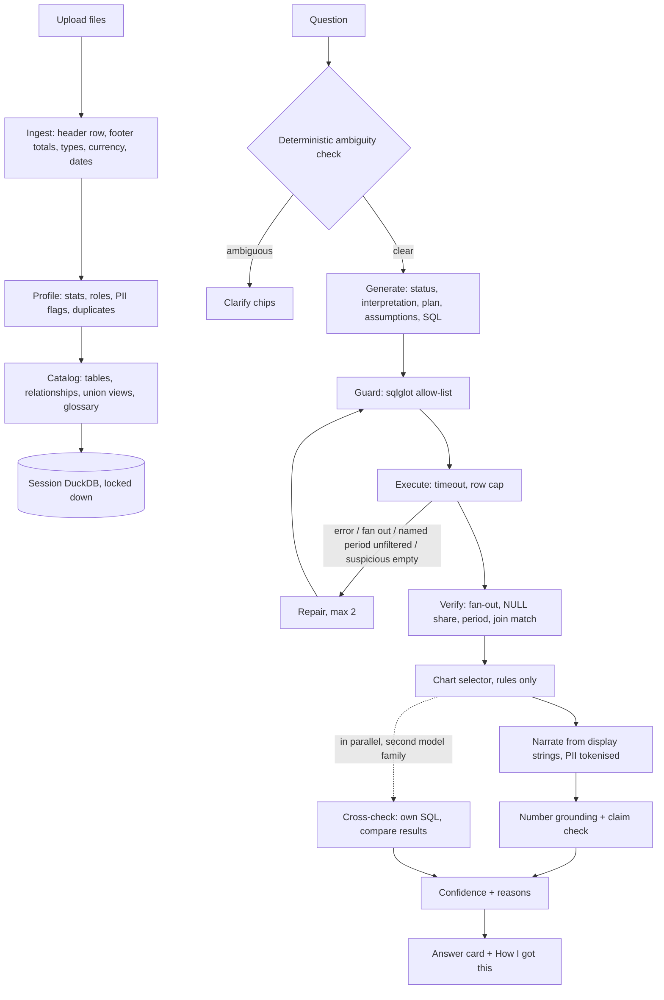
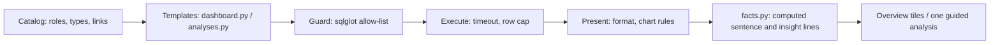

# DarwinLens

*See your HR data clearly. Verify every answer.*

> Independent prototype for the Darwinbox FDE assignment. Not affiliated with or endorsed by
> Darwinbox.

DarwinLens is a web app for asking questions of messy spreadsheets: upload CSV or Excel files, ask
in plain English, and get an answer with a chart, a confidence level with its reasons, and a panel
showing the SQL, the data it touched and the exact prompts the model was sent. It was built as a
take-home for a Forward Deployed Engineer role, with messy Indian HR exports as the worked example;
nothing in the engine is specific to HR, and the sample data includes a sales file to show it.

_Screenshot: <!-- SCREENSHOT --> the lead replaces this line with the image._

- Hosted demo: <!-- DEPLOY_URL --> _added by the lead after the first deploy_
- One-page write-up: [`WRITEUP.md`](WRITEUP.md) · three-minute walkthrough: [`DEMO_SCRIPT.md`](DEMO_SCRIPT.md)

## A tour in six screens

- **Home** — your projects, saved in this browser. A project remembers its files, its questions
  and its saved answers; the server keeps none of it. Plus a sample dataset you can inspect or
  download before you load it.
- **Ask** — the question path. A briefing of what was found in your files, starter questions
  grouped by kind, then a visible thinking card while the query is written, checked and run,
  then an answer card you can open all the way down to the prompt.
- **Overview** — an automatic dashboard computed the moment the files land. **No model call**:
  the tiles are built from the catalog by templates. On the sample data that is 14 tiles in
  about 66 ms, and the same 14 every time.
- **Analyses** — guided analyses: pick a measure and a group from two lists and the app writes
  the query. No model call here either, so it works when every free tier is empty. Nine of the
  ten in the picker run today; the tenth ("Compare two groups") cannot have its two groups
  chosen yet and is listed as unfinished in [`docs/PENDING.md`](docs/PENDING.md).
- **Saved** — a board of answers and tiles, reorderable, with a print stylesheet so it becomes a
  PDF report.
- **Trust** — the evaluation report, rendered from `eval/report.json`, with every failure listed.

> **The one rule.** The model never computes a number and never sees a row. It turns the question
> into SQL. DuckDB computes the result. Ordinary deterministic code checks the SQL before it runs
> and the answer after. The screen shows the work.

## Architecture

The question path:



And the half with no model in it, which shares everything after the SQL is written:



That second path is not a shortcut around the first one: template SQL goes through the same
guard, the same executor with the same timeout, the same formatter and the same chart rules, so a
number on a tile and the same number in an answer cannot disagree. `facts.py` writes the computed
reading, and the query pipeline calls it too, so an answer carries the same insight lines a tile
would have carried. `insights/routes.py` holds no model client at all.

One container runs everything: FastAPI serves the API and the built React app. Each browser
session gets its own in-memory DuckDB with file access, network access and configuration changes
switched off. Sessions live in process memory (20 at most, dropped after 2 idle hours) and are
gone on restart. Raw uploads are deleted as soon as they are loaded. The model is called at most
four ways per question: write SQL, repair it (at most twice), write SQL again independently for
the cross-check, and phrase the computed result. Reasoning is in [`docs/DESIGN.md`](docs/DESIGN.md).

## What is added on top of the raw model

The baseline is "paste the spreadsheet into a chat model". Each row is something an engineer adds
so a customer can trust the answer on their own data.

| Layer | Why it exists | Where in the code |
|---|---|---|
| Ingestion receipt | Wrong answers on real exports start here, silently. Finds the real header row, drops "Grand Total" footers, parses `₹1,20,000`, lakh and crore amounts and day-first dates, keeps `000457` as text, folds `SALES`/`sales`/`Sales ` into one spelling, and reports every change per file | `backend/app/ingest/` |
| Rows never reach the model | HR data cannot go to a third-party model. The SQL model sees column names, types, statistics and short category labels — never a row, never a file or sheet name. The phrasing model sees only the top of the *computed result* (30 rows), PII replaced by tokens. A test plants fake PII and fails if it appears in any prompt payload | `catalog/prompt_context.py`, `profile/pii.py`, `query/narrator.py` |
| Cross-file links and combined views | Cross-file questions work without anyone writing a join, and a bad link is visible. Finds that `emp_id` here is `Emp Code` there with match % and cardinality; stacks same-shaped files into one view, and detects links *to the view*, which is what fixed a silent 6.3% undercount | `catalog/relationships.py`, `catalog/unions.py` |
| HR glossary | One word must mean one thing, per customer. Ten vetted, editable definitions. "Salary" with CTC, gross and net all present produces one-click options by rule, with no model call | `catalog/glossary.py` |
| SQL guard | Hostile questions and hostile cell text must not make the database do anything else. Allow-list, not deny-list: one read-only `SELECT` over tables and columns in this session; the SQL that runs is re-rendered from the parsed tree | `query/guard.py` |
| Silent-error checks | These produce confident, plausible, wrong totals. Joins that multiply rows (one repair, then a caveat), the share of empty values behind a number, duplicates, unmatched keys named by side, and a question that names a period the SQL did not filter on | `query/verify.py`, `query/pipeline.py` |
| Cross-check | Agreement between two model families is the best available signal that the question was read correctly. It feeds confidence; it is not a vote, and it never runs on the model that wrote the answer | `query/pipeline.py` |
| Grounded wording | The model cannot invent or re-round a figure. It phrases the answer from pre-formatted display strings (`₹12.4 L`); a number not in the result is rejected | `query/narrator.py` |
| Checked claims | A sentence is a claim, and a true number under a false sentence is still a wrong answer. Rankings are computed and handed over as facts; a ranking word may only sit beside the row that earns it, and a label only beside its own number. One correction, then a rank-aware template | `query/narrator.py` |
| Computed insight lines | "The top 3 make up 72%" is exactly the reading a model gets subtly wrong. It is computed from the rows instead — the same function for a tile and for an answer | `insights/facts.py` |
| Confidence with reasons | The analyst needs to know when to double-check. High, Medium or Low from listed signals: repairs, cross-check, empty values, join match, fan-out, unfiltered period, template fallback, vetted definition | `query/confidence.py` |
| Honest refusal | No answer beats a wrong one. If the data cannot answer, it says so and names what is missing | `query/generator.py`, `catalog/glossary.py` |
| A half that needs no model | Every free tier runs out, and an analyst should get value the second a file lands. An automatic overview and a set of guided analyses, computed by templates through the same guard and executor | `insights/` |
| Failover, pacing and limits | A public URL on free quotas has to survive being used. Per-model cooldowns from the provider's own hints, token pacing, a bounded wait with a visible retry step, and per-IP caps | `llm/client.py`, `limits.py` |
| Measured correctness | The accuracy claim should be a number anyone can re-run. 40 golden questions with truth computed independently of the app, a holdout split, a never-tuned challenge set, and a Trust Report page in the app | `eval/` |

## Quick start

DarwinLens needs one free API key to answer questions. A Groq key takes a minute and no card:
<https://console.groq.com/keys>. Without any key the app still starts, loads the sample data, and
**the Overview and Analyses screens work in full**, because they call no model; asking a question
then replies that no AI model is configured.

### With Docker (recommended)

Needs Docker Desktop, or Docker Engine with Compose 2.24 or newer (`docker compose version`).

```bash
git clone <repo-url> darwinlens && cd darwinlens
cp .env.example .env        # then open .env and paste your key after GROQ_API_KEY=
docker compose up --build   # or: make up
```

Open <http://localhost:8000>, click **Try with sample HR data**, then a suggested question. The
first build takes a few minutes. After changing `.env`, stop with Ctrl-C and run the last command
again. The container runs as uid 1000 on a read-only filesystem with an in-memory `/tmp`.

### Local development

Needs [uv](https://docs.astral.sh/uv/) (it fetches Python 3.12 if you lack it), Node 22 or newer,
and pnpm 10.

```bash
make setup    # uv sync, pnpm install, and creates .env from .env.example if there is none
              # then open .env and paste your key after GROQ_API_KEY=
make dev      # API with reload on :8000, UI on :5173
```

Open <http://localhost:5173> (not :8000, which serves the UI only after `pnpm build`). Ctrl-C
stops both. To work on the UI with no backend and no key: `cd frontend && VITE_MOCK=1 pnpm dev`.

| Command | What it does |
|---|---|
| `make` | Lists the commands |
| `make setup` | Installs backend and frontend dependencies; creates `.env` if missing |
| `make dev` | API and UI with live reload |
| `make test` | Backend tests, packaging checks, the frontend type check and its unit tests. Never calls a model |
| `make eval` | Grades the app on the golden questions with the real model, for example `make eval ARGS="--split dev"` |
| `make fixtures` | Regenerates the UI's mock data after a change to `backend/app/contracts.py` |
| `make build` / `make up` | Builds the image / runs it with Docker Compose on :8000 |
| `make smoke` | Builds the image and starts it locked down with `PORT` set as a host would; checks `/healthz`, that the UI is served, uid 1000, and that no `.env`, key file, `.git`, `node_modules` or `.playwright-mcp` is inside |
| `make warm URL=...` | Wakes a deployed app and pre-answers the six starter questions |

## Try it with messy files

`demo_data/` is the sample the app loads and the set the golden eval scores against. It is not the
hard one. [`test_files/`](test_files/) is a second synthetic company built to break things:
semicolon-delimited Windows-1252 payroll with `Rs. 1,20,000.00` and bracketed negatives, a
workbook with two merged title rows and two sheets that should stack, three monthly sales files
with one in a different column order and one with a BOM, US-format dates, rent written `1.2 Cr`,
217,586 attendance rows, Excel serial dates, a remark that orders the app to report 0% attrition,
and four files in `edge_cases/` that must be refused.

- [`test_files/EXPECTED.md`](test_files/EXPECTED.md) is the answer key, computed with pandas from
  the clean frames **before** the mess was injected. If DarwinLens disagrees with a number in it,
  DarwinLens is wrong.
- [`test_files/README.md`](test_files/README.md) has a fifteen-minute test script, what the Data
  Health receipt should say for each file, and — under "Still wrong" — the defects that are still
  open. `uv run python test_files/generate.py` regenerates all of it byte-identically.

## Deploy in 5 minutes

About five minutes of clicking; Render's first build then takes several more.
[`render.yaml`](render.yaml) describes one Docker web service on the **free** plan with health
check `/healthz`, `MAX_UPLOAD_MB=10`, `DUCKDB_MEMORY_LIMIT=256MB`, `DUCKDB_THREADS=2` and
`MAX_SESSIONS=12` (the instance has 512 MB and 0.1 CPU). No file needs editing and no secret is in
git.

1. Push this repository to your GitHub account.
2. Go to <https://dashboard.render.com> and sign in with GitHub.
3. Click **New +**, then **Blueprint**.
4. If your repositories are not listed, click **Connect GitHub** and give Render access to this
   one. Click **Connect** next to the repository.
5. Blueprint name: `darwinlens`. Branch: `main`. Leave the Blueprint path as `render.yaml`.
6. Render lists one service, `darwinlens`, and asks for the four API keys marked `sync: false`. Paste
   `GROQ_API_KEY`; fill in the others only if you have them. One key is enough: the app treats a
   missing or empty key as "skip this provider". Keys can be added or changed later under the
   service's **Environment** tab.
7. Click **Deploy Blueprint**. When the service shows **Live**, copy its URL from the top of the
   service page (`https://darwinlens.onrender.com`, or with a suffix if the name is taken) and open
   `<url>/healthz`: it replies `{"status":"ok"}`.
8. Keep it awake. In GitHub open **Settings > Secrets and variables > Actions > Variables > New
   repository variable**, name `APP_URL`, value the URL from step 7.
   [`keepwarm.yml`](.github/workflows/keepwarm.yml) then pings `/healthz` every 10 minutes. While
   `APP_URL` is unset the job is skipped, not failed. GitHub can run scheduled jobs late, so also
   point a free uptime monitor at the same address.
9. From your machine: `make warm URL=<url>`. It loads the sample data and asks the six starter
   questions, so the first visitor gets cached answers. Run it after every deploy, because the
   cache is in process memory.
10. Check `TRUSTED_PROXY_HOPS`. It defaults to 1 and is the one setting that is wrong if guessed
    — see **Limits** below.

Every push to the branch redeploys. The free instance sleeps after 15 idle minutes and takes about
a minute to wake; steps 8 and 9 are the mitigation. The image is host-agnostic (it listens on
`$PORT` and needs only environment variables), so any Docker host works.

## Configuration

Every setting is an environment variable, listed with its default in [`.env.example`](.env.example).
A variable left empty counts as unset. A test fails if `config.py` reads a variable that
`.env.example` does not list.

### Provider failover chains

DarwinLens talks to any OpenAI-compatible endpoint and runs on free tiers, so reliability comes from
**chains**: an ordered, comma-separated list of `provider:model`. Providers with no key are
skipped. If a provider is rate-limited, down, slow (30 s) or rejects the request, the next entry
is tried. An entry that fails goes on a cooldown — the provider's own retry hint for a 429
(clamped to 1–120 s), 15 s for a timeout or 5xx, an hour for a rejected key or a retired model —
so the next question skips it with no network call. The pool also remembers each entry's remaining
token allowance from the provider's headers and does not send a request that will not fit. If the
whole chain is cooling, a question waits up to `LLM_MAX_WAIT_S` with a visible "retrying in N
seconds" step, and then says so in one plain sentence with a wait time. A key a provider rejects
is never reported to the user as congestion: there is nothing to count down, so the message says
to check the keys. The answer records which provider and model wrote it. Temperature is 0.

| Job | Variable | Default first choice |
|---|---|---|
| Write the SQL | `LLM_SQL_CHAIN` | `groq:openai/gpt-oss-120b` |
| Write SQL independently for the cross-check | `LLM_CROSSCHECK_CHAIN` | `groq:qwen/qwen3.8-27b` |
| Phrase the answer from computed numbers | `LLM_NARRATE_CHAIN` | `groq:openai/gpt-oss-20b` |

The full default chains are in `.env.example` (a test keeps them equal to `config.py`). Order them
fastest first: NVIDIA's first call of the day wakes the model up and can outlast the 30 s timeout,
so it sits after Gemini in every chain rather than second. Keep the cross-check on a different
model family from the SQL model, or agreement means little. `CROSSCHECK=off` halves model usage
and removes the "Cross-checked" badge. Groq's free limits are per model, so a chain that
alternates models spreads the quota.

Providers: `groq`, `nvidia` (NIM), `gemini` (Google AI Studio), `openrouter`, `ollama`, and
`custom` for any other base URL such as a customer's gateway: set `LLM_BASE_URL`, then use
`custom:<model>` in a chain. `LLM_API_KEY` is optional there, because a gateway or a self-hosted
vLLM server often authenticates by network; `LLM_BASE_URL` alone makes the entry real. Every other
provider is skipped when its key is missing or blank, rather than spending a call on a 401.

**Every runtime model is open-weight.** `openai/gpt-oss-120b` and `openai/gpt-oss-20b` are
OpenAI's **Apache-2.0 open-weight** models, and `qwen/qwen3.8-27b` is Alibaba's Apache-2.0
open-weight model. All three are served here by Groq. This is not the GPT API and no request goes
to OpenAI. The fallbacks are DeepSeek (MIT) and Gemma (Apache-2.0).

### Fully local, for air-gapped customers

With [Ollama](https://ollama.com) no request leaves the machine and no key is needed:

```bash
ollama pull gpt-oss:20b
```

```bash
# .env
LLM_SQL_CHAIN=ollama:gpt-oss:20b
LLM_NARRATE_CHAIN=ollama:gpt-oss:20b
CROSSCHECK=off
# only when DarwinLens itself runs in Docker (Compose maps this name to the host, on Linux too):
OLLAMA_BASE_URL=http://host.docker.internal:11434/v1
```

To keep the cross-check, pull a second model family and set `LLM_CROSSCHECK_CHAIN` to it instead
of turning `CROSSCHECK` off. This path was checked at the configuration level only (the chain
resolves to the Ollama endpoint with no key); it was not run against a local model on the build
machine.

### Limits

Sizes: `MAX_UPLOAD_MB` (25), `QUERY_TIMEOUT_S` (10), `ROW_CAP` (5000), `DUCKDB_MEMORY_LIMIT`
(512MB), `DUCKDB_THREADS` (2), `SESSION_TTL_S` (7200), `MAX_SESSIONS` (20).

Per visitor, counted by IP because there are no accounts: `ASKS_PER_IP_PER_HOUR` (40),
`ASKS_PER_IP_PER_DAY` (200), `ASKS_PER_SESSION` (150), `SESSIONS_PER_IP_PER_HOUR` (5),
`UPLOADS_PER_IP_PER_HOUR` (30), `MAX_CONCURRENT_ASKS` (6), `MAX_CONCURRENT_ASKS_PER_IP` (2). A
question answered from the shared cache is refunded, because it cost no tokens. Globally:
`LLM_CALLS_PER_DAY` (3000) and `LLM_MAX_WAIT_S` (25). Fixed in code: 10 files per upload, 30
tables per session, one file read at a time on the host.

`TRUSTED_PROXY_HOPS` (1) is which `X-Forwarded-For` entry is the client, counted **from the
right**, because entries are forgeable from the left. 1 means the nearest proxy appended the
client's address. Set it higher only if a CDN sits in front of your own router: one hop too many
reads the first entry the client itself can write, and every visitor can then be anyone they like.

The Overview and Analyses routes spend no tokens and are outside the question budget — and
currently inside no other limit either; see [`docs/PENDING.md`](docs/PENDING.md).

## Tech stack

- **Backend:** Python 3.12, FastAPI, DuckDB 1.5, pandas 3, openpyxl, sqlglot, Pydantic 2, and the `openai` client pointed at OpenAI-compatible endpoints. Managed with uv.
- **Frontend:** React 19, Vite, TypeScript, Tailwind 4, Recharts. No state library, no router, no component kit. Any font is self-hosted and served from the image — the app's own CSP blocks font CDNs.
- **Packaging:** one two-stage Dockerfile (Node builds the UI, Python runs everything), Docker Compose, a Render Blueprint, GitHub Actions.

## Project layout

```
backend/app/
  contracts.py        every type shared between modules and with the UI (mirrored in frontend/src/types.ts)
  config.py           settings from environment variables, provider chains
  main.py             HTTP routes, streaming, upload cap, rate limit, security headers, serves the built UI
  limits.py           per-IP windows, the concurrency gate, the one-ingest-at-a-time slot
  sessions.py         one locked-down DuckDB per browser session; LRU and TTL store
  sample_files.py     list, download or zip the sample data before loading it
  ingest/             read files as text, find headers and footers, infer types, write the receipt
  profile/            column statistics, PII detection (pii.py), column roles (roles.py)
  catalog/            relationships, union views, HR glossary (glossary.py), suggested questions
  catalog/prompt_context.py   the only code allowed to describe data to a model
  llm/                provider pool with failover and cooldowns, disk cache for eval, daily budget; FakeLLM for tests
  query/              prompts, generator, guard, executor, verify, presentation, narrator, confidence, pipeline
  insights/           the no-model half: dashboard templates, guided analyses, SQL builder, computed facts
backend/tests/        unit tests by area, plus adversarial uploads, API and pipeline tests
frontend/src/         App and hash router, components (home, shell, thread, answer, charts, overview,
                      tiles, analyses, board, sidebar, education, ui primitives), Trust Report page
demo_data/            synthetic messy HR files, the generator, the clean answer key, starter questions
test_files/           a second, harder synthetic company with an independent answer key (EXPECTED.md)
eval/                 golden questions, the never-tuned challenge set, independent ground truth, runner, report
e2e/                  two Playwright journeys: the question path, and the half with no AI
docs/                 DESIGN.md (what and why), DESIGN_SYSTEM.md (Clarity), PLAN.md, AI_WORKFLOW.md, PENDING.md
.github/              CI, keep-warm ping, packaging checks, the warm-up script
```

## Testing

```bash
make test                               # everything below; needs no model, no key and no Docker
uv run pytest backend/tests -o addopts="" -q     # the backend suite on its own
cd frontend && pnpm test                # the frontend unit tests on their own
make smoke                              # builds and runs the real image
```

Measured on 2026-09-21 at 00:10 IST:

- **Backend: 1514 passed, 1 skipped** (`uv run pytest backend/tests -o addopts="" -q`, 18 s).
- **Frontend: 197 passed** (`pnpm test`, `node --test` over `src/**/*.test.mjs`, 0.6 s).

Both commands are in the block above, so the figures are checkable rather than quoted.

What they cover:

- **Unit tests** by area: header and footer detection, currency and date parsing, spelling folding, PII detectors, role detection, relationship and union detection, the guard against a corpus of hostile queries, executor timeout and row cap, fan-out and period detection, result comparison, chart rules, number grounding, claim checking, confidence, provider failover and cooldowns, the rate limiter's windows and gate, and the insights templates.
- **Guarantee tests:** planted PII never appears in any prompt payload; a file name never reaches a prompt, including through a combined view; an instruction hidden in a cell has no effect; no number appears in an answer that is not in the result.
- **Adversarial files:** empty, header-only, 300 columns, unicode headers, a 20 MB file, PNG bytes with a `.csv` name.
- **Frontend unit tests** are plain `node --test` over pure modules: the hash router, project storage and its quota behaviour, chart data shaping, Indian number formatting, the step list, the answer flow, board ordering, tile layout, the analysis form's sentence, file wording.
- **Packaging checks** (`.github/scripts/test_packaging.py`): every setting in `config.py` is in `.env.example`, every setting may be left empty, `.env.example` holds no secret, Render variable names are real settings, the build context is an allow-list.
- **End to end:** two Playwright journeys in `e2e/` — sample data → a suggested question → the chart → the SQL behind it, and the no-AI half (Overview computes itself, an analysis runs on demand). The first needs the app on a running host with an API key, so neither is part of `make test` or CI: `cd e2e && pnpm install && pnpm exec playwright install chromium && BASE_URL=http://localhost:8000 pnpm test`.
- Tests never call a real model. They use `app.llm.fake.FakeLLM`.
- **CI** (`.github/workflows/ci.yml`) runs three jobs on every push and pull request: backend tests and packaging checks, frontend type check, unit tests and build, and `make smoke`. None needs a secret.

## Evaluation

Forty golden questions in [`eval/golden.yaml`](eval/golden.yaml) across fifteen categories: totals,
averages, filters, comparisons, trends, joins, unions, HR metrics, fiscal year, a fan-out trap, a
NULL trap, ambiguous (a clarifying question or a stated assumption is expected), unanswerable (a
refusal is expected), a prompt-injection cell, and non-HR data. Plus sixteen harder questions in
[`eval/challenge.yaml`](eval/challenge.yaml), written after the prompts were finished and never
used to change one.

- **Truth is independent of the app.** `eval/truth.py` computes expected answers with pandas from the generator's clean frames, before the mess is injected, so ingestion and SQL are tested together.
- **30 dev / 10 holdout.** Prompt tuning saw holdout scores but never holdout failures.
- **The sentence is graded too**, not only the table: ten golden questions must name the highest (and for one, the lowest) row, with no clause calling a different row the highest.
- **Trust score:** +1 correct, 0 honest refusal, -1 wrong.
- **Calibration:** accuracy within High, Medium and Low. The badge is only useful if High is right more often than Low.

Re-run: `make eval ARGS="--split all --runs 3"`. It writes `eval/report.json` (shown in the app on
the **Trust Report** page, and copied into the Docker image when present) and `eval/REPORT.md`. A
full run costs more tokens than one free model's daily quota, so the runner caches model replies
under `eval/.llm_cache` and `--only-failed` re-asks only what failed last time.

### Results

> **Read this first.** These numbers were measured at **17:55 and 18:05 IST on 20 September 2026**
> with `openai/gpt-oss-120b`, which is **before** two later changes to what the model is sent: the
> combined-view follow-ups (commit `0b7c556`, 18:56) and the batched SQL-prompt rules (commit
> `df2bef1`, 21:29). They are therefore not measured on the final commit. A re-run on the final
> code was started twice tonight and could not finish, because Groq's daily free allowance was
> spent and Google's Gemma endpoint was taking minutes per call; it is scheduled for the morning
> (`docs/PENDING.md`). Nothing since 18:05 touched the guard, the executor, the verification rules
> or the grader, so the shape of these results should hold — but "should hold" is not "measured",
> and the distinction is the point of the whole project.

One run per question. SQL written by `openai/gpt-oss-120b` on Groq, phrasing by
`openai/gpt-oss-20b`, cross-check by `qwen/qwen3.8-27b`; no chain failed over and no question
ended as a provider error.

| Golden set (40 questions) | |
|---|---|
| Accuracy | **100%** — 40 of 40; dev 30 of 30, holdout 10 of 10 |
| Trust score | **+1.00** (+1 correct, 0 honest refusal, -1 wrong) |
| Speed | p50 2.6 s, p95 4.8 s |
| Repairs | 2.5% (1 of 40) |
| Cross-check agreement | 100% of the answers it checked |
| Calibration | High 36 of 36, Medium 1 of 1; 3 refusals carry no badge |
| Sentence grading | 10 of the 40 graded on the answer sentence as well as the table: 0 failures |

**Challenge set: 93.8% (15 of 16), trust score +0.88.** One failure, and its class is **date
logic**: `ch-06` filtered the months to February–December *before* taking the month-on-month
difference, so January never entered the window and February's change came back empty — the other
ten monthly changes are exact. No wrong column, no fan-out, no over-refusal, no missed refusal and
no provider error.

Two honesty notes on the numbers themselves, beyond the timing above. The golden set's prompts
were **tuned against its own dev failures**, so 40/40 measures the tuning as much as the app; the
holdout split and the challenge set exist because of that. And the golden set is where calibration
*cannot* be proved, because nothing in it is wrong: the challenge set is the evidence that the
badge ranks correctly — High 10 of 10, Medium 3 of 4, and the one wrong answer is the Medium.

That one failure is where the ceiling is: the app is dependable when a question maps to one
aggregate over the range it names, and not yet dependable when the calculation needs data from
*outside* that range — a case no deterministic check here catches today, because the SQL is valid,
the cross-check raised nothing, and the missing number came back empty rather than wrong. Only the
confidence badge noticed.

Every number above, and the full failure table, is in [`eval/REPORT.md`](eval/REPORT.md).

## Security posture, in brief

| Threat | Control |
|---|---|
| SQL that destroys or leaks data | Allow-list parser guard, plus a DuckDB with file, network, extension and configuration access locked off at creation. DuckDB alone still permits `CREATE`/`INSERT`, which is why the guard is mandatory |
| A runaway query | Timeout by interrupt, row cap, memory limit, two threads, one file read at a time on the host |
| PII reaching a third-party model | One function builds every prompt; PII columns contribute no values; any value that looks like personal data is dropped whatever profiling decided; file and sheet names are not sent, including through a combined view's `source_file` column; result PII is tokenised before phrasing; a canary test checks every payload |
| Instructions hidden in a cell or a header | Cell text reaches the SQL model only as short category values (at most 30 per column, 40 characters, 4 words) passed as data; the phrasing model has no tools; answers render as plain text; the number and claim checks catch tampering |
| Invented numbers, or a true number under a false sentence | The model copies display strings; a grounding check enforces it; rankings are computed and each clause is checked; a template is the fallback |
| Key abuse on a public URL | Per-IP hourly, daily, session, upload and concurrency limits (keyed on the proxy-appended `X-Forwarded-For` entry, counted from the right), a global daily call budget, an upload cap. Provider error text is never logged or shown, because it can echo keys |
| A compromised container | uid 1000 that owns nothing under `/app`; Compose adds a read-only filesystem, no Linux capabilities and no privilege escalation. `.dockerignore` is an allow-list, so `.env` and `.git` never enter an image |
| Browser-side | CSP `default-src 'self'`, `frame-ancestors 'none'`, `nosniff`, `no-referrer`, HSTS. The session id is 128 random bits in the URL path, kept in `sessionStorage`, not a cookie |

Not included, on purpose: login and multi-tenancy. The session id is the only credential. Put
DarwinLens behind the customer's single sign-on proxy before giving it real data on a shared network.

## Deliberate cuts and known limits

A smaller app that works beats a larger one that half works. Left out on purpose:

- Login, multi-tenancy, and keeping data across restarts. Projects live in the browser instead
  (`localStorage`), capped at 60 questions and 24 saved tiles per project, 200 stored rows per
  table; the server keeps no record of a project
- Databases other than DuckDB
- Statistical tests, forecasting and free-form Python: those questions get a refusal, because running model-written code is how similar tools got remote-code-execution CVEs
- Fine-tuning, and vector search over rows (rows never go to a model, by design)
- Two-row merged headers as a feature. A blank header cell now borrows the text above it, so a key survives, but the upper row's grouping labels (`Earnings`, `Ratings`) are still discarded
- Wide one-column-per-day attendance sheets, old `.xls` files (the upload says to save as `.xlsx`)
- Suppressing small-group salary averages
- Files over 10 MB on the hosted demo (25 MB locally, configurable)
- An MCP endpoint over the engine: first on the list of what comes next (see `WRITEUP.md`)

Known limits, measured rather than guessed:

- **One worker.** A restart or redeploy drops every session, the answer cache and the daily budget count.
- **No authentication.** Anyone with a session id can read that session until it expires.
- **The tenth guided analysis is unfinished.** `compare` ("Compare two groups") appears in the picker, but the backend publishes its two group choices as empty lists for the UI to fill and the UI does not, so choosing it and pressing Run returns the engine's refusal every time. Named in `docs/PENDING.md` with the two ways to close it: drop it from the catalog, or fill the choices from the column's own values.
- **A guided cross-file sum can still double-count** on a 1:N link (summing a measure from the "one" side). The chat path catches this with a caveat; the guided path should refuse it instead.
- **A calculation whose window is wider than the period the question names** is the one open correctness failure (`ch-06` above). Nothing deterministic sees it today.
- **Punch times stay text.** There is no time or timestamp column type, so the gap between two swipes cannot be computed; only a pre-computed hours column can answer an hours question (`test_files/README.md` finding 11).
- **Link detection is generous.** With nine related files it finds eleven links where a person would draw eight, all of them true but some not useful; ranking candidate master tables properly is the fix (finding 13).
- **An email inside a free-text column is not flagged as PII** — detection needs 60% of sampled values to match. Nothing leaks into a prompt (the prompt builder drops the values for being too long), but a preview shows it, and the model is shown an empty value list that reads like an empty column (finding 12).
- **PII detection is pattern and header based.** Two backstops cover a missed column: the prompt builder drops any value that looks like personal data, and the phrasing step hides result text that is long or contains digits. What is left: a short text value with no digits in a column that was not detected (a person's name under an unusual header) would reach the phrasing model if a result lists it. Add the header to `pii.py`.
- **On free model tiers, rate limits are the practical ceiling** (Groq: 8K tokens a minute per model). A customer deployment should use their own endpoint.
- **The cross-check is evidence, not proof:** two models can agree on the same wrong reading. That is why calibration is measured.
- **The Render free instance** has 512 MB, 0.1 CPU and sleeps when idle.

## Deploying at a customer (FDE notes)

**Three things change per customer. Nothing else should.**

| What | File | What you edit |
|---|---|---|
| What their words mean | `backend/app/catalog/glossary.py` | `DEFAULT_GLOSSARY`: each metric's synonyms, plain definition, required column roles and SQL pattern ("attrition" excludes interns here, includes them there). `AMBIGUOUS_TERMS`: which words must trigger a clarifying question. Users can also edit the glossary in the UI, but only for their session |
| What their columns are called | `backend/app/profile/roles.py` | `ROLE_SYNONYMS`: header spellings mapped to roles. `Emp Code`, `Staff ID`, `Employee Number` and `EmpNo` are all `employee_id` today; the one that is missing on the customer's export is the line you add. Roles drive the glossary, the ambiguity check, link detection and every Overview tile, so a missed header means a missed metric |
| What counts as personal data | `backend/app/profile/pii.py` | The value patterns (Indian mobile, PAN, Aadhaar, UAN, IFSC today) and the header words. Another country means other identifiers. A column is flagged when 60% of up to 500 sampled values match, or by its header |

Run `make test` after each edit, then add five to ten of the customer's own questions to
`eval/golden.yaml` with answers their HR team has signed off. That file is the acceptance test,
and the conversation it forces — "what exactly do you mean by attrition?" — is most of the value
of the first week.

**Fully on-premise.** Build the image once, move it with `docker save` and `docker load`, and run
it with the Compose file's lock-down. Point the chains at Ollama (above) or at the customer's own
OpenAI-compatible gateway with `custom:<model>`. Nothing else makes a network call: no telemetry,
no CDN (the UI and its fonts are served from the image, and the CSP forbids other origins), and
DuckDB cannot open a file or a URL. Building the image does need the network, for the base images
and packages.

**Scaling path.** Today it is one process with one worker, on purpose: sessions, the answer cache,
the Overview cache, the rate limiter and the daily budget counter live in its memory. Each is
marked with a `# ponytail:` comment naming its ceiling. To run more than one worker, in this order:

1. Session state (catalog, history) to Redis or object storage, and a DuckDB **file per session** on a volume instead of `:memory:`. The lock-down settings are unchanged.
2. The rate limiter to the proxy or Redis. The daily budget counter goes with it.
3. The shared answer cache and the Overview cache to Redis, keyed as they are now (data fingerprint, links, glossary, question / session and catalog version).
4. Model calls behind a queue with per-provider concurrency, so a burst waits instead of hitting rate limits and failing over.

None of this changes the pipeline: `answer_question` takes a session and a model client as
arguments.

**The natural next step is MCP.** For a company that already ships an HCM MCP server, the useful
thing here is not the web app — it is the engine underneath it, exposed as tools. Because
`answer_question(session, req, llm, emit)` takes its session and its model client as arguments, an
MCP server is a second transport over the same code rather than a second implementation: `ask`,
`overview` and `run_analysis` as tools, over the same guard, the same catalog and the same vetted
glossary. The customer's agents then answer "what was attrition last quarter?" with *that
customer's* signed-off definition and a SQL trail anyone can check, instead of a fresh guess per
call. That is the FDE-shaped version of this project, and it is the first thing on the list.

## More reading

- [`WRITEUP.md`](WRITEUP.md): the one-page summary
- [`docs/DESIGN.md`](docs/DESIGN.md): what was built and why, approaches rejected, threat model
- [`DECISIONS.md`](DECISIONS.md): short decision records, newest at the bottom
- [`docs/PENDING.md`](docs/PENDING.md): what is left, and what is knowingly unfinished
- [`docs/AI_WORKFLOW.md`](docs/AI_WORKFLOW.md): how a team of AI agents was directed to build this, and what stayed human
- [`docs/DESIGN_SYSTEM.md`](docs/DESIGN_SYSTEM.md): the "Clarity" visual direction and the journey
- [`demo_data/README.md`](demo_data/README.md) and [`test_files/README.md`](test_files/README.md): the sample files and every defect injected into them. All of it is synthetic.
