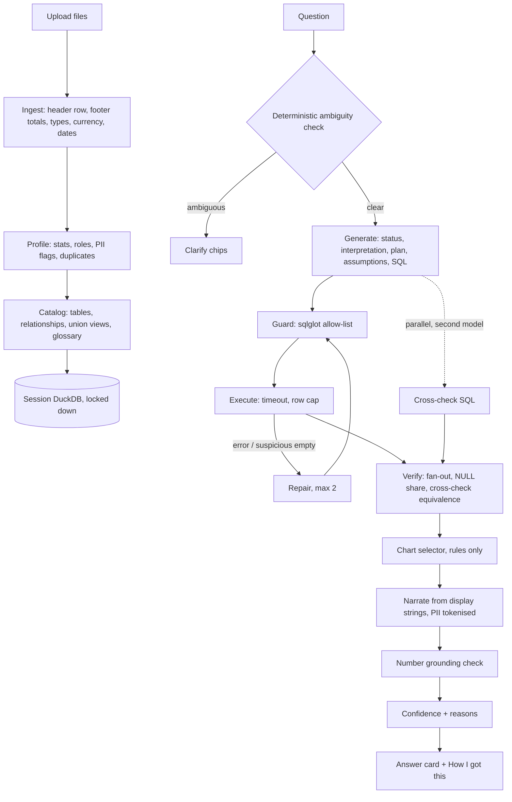

# Verity

**Ask your spreadsheets. Verify every answer.**

Verity is a small web app for people who get handed a messy export and need a number they can
defend. Upload one or more CSV or Excel files, ask a question in plain English, and get an answer
with a chart, a confidence level with its reasons, and a "How I got this" panel that shows the
exact query, the data it touched and everything the AI model was shown.

It was built as a take-home for a Forward Deployed Engineer role, with Indian HR data as the
worked example (payroll registers with title rows and "Grand Total" footers, amounts typed as
`₹1,20,000`, employee codes with leading zeros, and words like "attrition" and "salary" that
mean different things to different people). Nothing in the engine is specific to HR: the sample
data includes a sales file to prove it.

- Hosted demo: <!-- DEPLOY_URL --> _added by the Lead after the first deploy_
- Three-minute walkthrough: [`DEMO_SCRIPT.md`](DEMO_SCRIPT.md)

## The one rule

> The AI model never computes a number and never sees a row of your data.
> It turns your question into SQL. A database (DuckDB) computes the result. Ordinary,
> deterministic code checks the SQL before it runs and the answer after. The screen shows the work.

Everything else in this repository exists to make that rule true, and to prove it.

## Try it in a minute

```bash
git clone <this repository> && cd <folder>
cp .env.example .env        # add one free API key, for example GROQ_API_KEY
docker compose up --build   # then open http://localhost:8000
```

Click **Try with sample HR data**, then click any suggested question. No key yet? The app still
starts and loads the sample data, so you can read the Data Health receipts and the detected
relationships. Asking a question needs at least one key (all the listed providers are free).

## Architecture



One container runs everything: FastAPI serves the API and the built React app. Each browser
session gets its own in-memory DuckDB with file access, network access and configuration changes
switched off. Sessions live in memory (20 at most, 2 hours idle) and are gone on restart; nothing
you upload is written to permanent storage, and the raw upload is deleted as soon as it is loaded.

The full reasoning is in [`docs/DESIGN.md`](docs/DESIGN.md).

## The delta: what is added on top of a raw model call

The baseline is "paste the spreadsheet into a chat model". This is what an engineer adds so a
customer can trust the answer on their real data.

| Layer | What it does | Why it matters | Where |
|---|---|---|---|
| Ingestion receipt | Finds the real header row, drops "Total" footers, parses `₹`, lakh and crore amounts and day-first dates, keeps `000457` as text, and reports every change per file | Most wrong answers on real exports start here, silently | `backend/app/ingest` |
| Privacy by construction | Detects PII (names, email, phone, PAN, Aadhaar, UAN, bank details). The model gets table structure and statistics only. PII in results is replaced by tokens before the answer is phrased. "What the model saw" shows the exact prompts | HR data cannot go to a third-party model. A test plants fake PII and fails if it ever appears in a prompt | `backend/app/profile`, `backend/app/catalog/prompt_context.py` |
| Cross-file understanding | Finds that `emp_id` in one file is `Emp Code` in another, with match % and cardinality; stacks same-shaped files (`attendance_q1` + `attendance_q2`) into one view. You can confirm or reject each | Cross-file questions work without anyone writing a join | `backend/app/catalog` |
| HR glossary | "Attrition", "headcount", "LOP %" and more each have one vetted, editable definition. "Salary" with CTC, gross and net all present produces a one-click question instead of a guess | The same word must mean the same thing every time, per customer | `backend/app/catalog/glossary.py` |
| SQL guard | The model's SQL is parsed and must be a single read-only `SELECT` over known tables and columns. Allow-list, not deny-list | Hostile questions and hostile cell text cannot make the database do anything else | `backend/app/query/guard.py` |
| Silent-error checks | Detects joins that multiply rows (fan-out), reports the share of empty values behind a number, and notes duplicates | These produce confident, plausible, wrong totals | `backend/app/query/verify.py` |
| Cross-check | A second model from a different family writes its own SQL; the two results are compared | Agreement is the best available signal that the question was read correctly | `backend/app/query/pipeline.py` |
| Grounded wording | The model phrases the answer from pre-formatted numbers. Any number in its sentence that is not in the result is rejected, and a plain template is used instead | The model cannot invent or re-round a figure | `backend/app/query/narrator.py` |
| Confidence with reasons | High, Medium or Low, with the reasons listed | The analyst knows when to double-check before a meeting | `backend/app/query/confidence.py` |
| Honest refusal | If the data cannot answer, it says so and names what is missing | Better no answer than a wrong one | `backend/app/query/generator.py` |
| Measured correctness | 40 golden questions with independently computed truth, a holdout split, and a Trust Report page inside the app | The accuracy claim is a number anyone can re-run | `eval/`, Trust Report page |

## Quick start

### With Docker (recommended)

You need Docker only: Docker Desktop, or Docker Engine with Compose 2.24 or newer
(`docker compose version`).

```bash
cp .env.example .env        # add at least one API key
docker compose up --build   # or: make up
```

Open http://localhost:8000. The container runs as a normal user, on a read-only filesystem, with
an in-memory `/tmp` as its only writable place.

### Local development

You need Python 3.12 with [uv](https://docs.astral.sh/uv/), and Node 22 with pnpm 10.

```bash
make setup    # installs both sides and creates .env from the example
make dev      # API with reload on :8000, UI on :5173; open http://localhost:5173
```

To work on the UI without a backend or a key: `cd frontend && VITE_MOCK=1 pnpm dev`.

Run `make` on its own to list every command.

| Command | What it does |
|---|---|
| `make setup` | Install dependencies and create `.env` |
| `make dev` | API and UI with live reload |
| `make test` | Backend tests, packaging checks and the frontend type check. Never calls a model |
| `make eval` | Grade the app on the golden questions with the real model, for example `make eval ARGS="--split dev"` |
| `make fixtures` | Regenerate the UI's mock data after a change to `backend/app/contracts.py` |
| `make build` / `make up` | Build the image / run it with Docker Compose |
| `make smoke` | Build the image, start it locked down, check `/healthz`, that it is not running as root, and that no `.env`, key file, `.git` or `node_modules` is inside |
| `make warm URL=...` | Wake a deployed app and pre-answer the starter questions |

## Configuration

Every setting is an environment variable, listed with its default and a plain explanation in
[`.env.example`](.env.example). You only need one API key to start.

### Model providers and chains

Verity talks to any OpenAI-compatible endpoint. It runs on free tiers only, so reliability comes
from **failover chains**: an ordered list of `provider:model`. If the first is rate-limited or
down, the next one is tried, and the answer records which one was used. Providers without a key
are skipped.

| Job | Variable | Default first choice |
|---|---|---|
| Write the SQL | `LLM_SQL_CHAIN` | `groq:openai/gpt-oss-120b` |
| Write SQL independently for the cross-check (a different model family) | `LLM_CROSSCHECK_CHAIN` | `groq:qwen/qwen3.8-27b` |
| Phrase the answer from computed numbers | `LLM_NARRATE_CHAIN` | `groq:openai/gpt-oss-20b` |

Built-in providers: `groq`, `nvidia` (NIM), `gemini` (Google AI Studio), `openrouter`, `ollama`,
and `custom` (any base URL, for example a customer's own gateway: set `LLM_BASE_URL` and
`LLM_API_KEY`, then use `custom:<model>` in a chain).

**Every runtime model is open-weight** under an OSI-approved licence. A note on naming:
`gpt-oss` is OpenAI's **Apache-2.0 open-weight** model family, served here by Groq. It is not the
GPT API, and no request goes to OpenAI. DeepSeek is MIT; Qwen and Gemma are Apache-2.0.

### Fully local, nothing leaves the machine

For an air-gapped or strict customer, run the model locally with [Ollama](https://ollama.com):

```bash
ollama pull gpt-oss:20b
```

```bash
# .env
LLM_SQL_CHAIN=ollama:gpt-oss:20b
LLM_NARRATE_CHAIN=ollama:gpt-oss:20b
CROSSCHECK=off
# only when Verity itself runs in Docker:
OLLAMA_BASE_URL=http://host.docker.internal:11434/v1
```

To keep the cross-check, pull a second model family and set `LLM_CROSSCHECK_CHAIN` to it instead
of turning `CROSSCHECK` off.

### Limits

Upload size, query timeout, row cap, DuckDB memory and threads, session lifetime, questions per IP
address per hour and model calls per day are all settings. See the "Limits" block in
[`.env.example`](.env.example). The hosted demo runs with a 10 MB upload cap and 256 MB of DuckDB
memory because the free host has 512 MB in total.

## Security model

| Threat | Control |
|---|---|
| SQL that destroys or leaks data | Allow-list parser guard, plus a DuckDB with file, network and configuration access locked off. Either alone would stop it |
| A runaway query | Timeout by interrupt, row cap, memory limit, two threads |
| PII reaching a third-party model | One function builds every prompt; PII columns contribute no values; result PII is tokenised before phrasing; a canary test checks every payload |
| Instructions hidden in a cell or a header | Cell text is never sent to the SQL model except short, capped category values passed as data; the phrasing model has no tools; answers render as plain text; the number check catches tampering |
| Invented numbers | The model copies display strings; a grounding check enforces it; a template is the fallback |
| Abuse of the API key on a public URL | Per-IP limit, a global daily call budget, an upload cap, and a spend cap at the provider |
| A compromised container | Runs as uid 1000, owns nothing under `/app`; Compose adds a read-only filesystem, no Linux capabilities and no privilege escalation. `.dockerignore` is an allow-list, so `.env` and `.git` never enter an image |

Not included, on purpose: login and multi-tenancy. Put Verity behind the customer's own
single sign-on proxy before giving it real data on a shared network.

## Tech stack

- **Backend:** Python 3.12, FastAPI, DuckDB 1.5, pandas 3, openpyxl, sqlglot, Pydantic 2, the `openai` client pointed at OpenAI-compatible endpoints. Managed with uv.
- **Frontend:** React 19, Vite, TypeScript, Tailwind, Recharts. No state library, no router, no component kit.
- **Packaging:** one Dockerfile (Node builds the UI, Python runs everything), Docker Compose, a Render Blueprint, GitHub Actions.

## Project layout

```
backend/app/
  contracts.py        every type shared between modules and with the UI
  config.py           settings from environment variables, provider chains
  main.py             HTTP routes, streaming, upload cap, rate limit, serves the built UI
  sessions.py         one locked-down DuckDB per browser session
  ingest/             read files as text, find headers and footers, infer types, write the receipt
  profile/            column statistics, PII detection, column roles
  catalog/            relationships, union views, HR glossary, suggested questions
  catalog/prompt_context.py   the only code allowed to describe data to a model
  llm/                provider pool with failover, cache and daily budget; FakeLLM for tests
  query/              generator, guard, executor, verify, presentation, narrator, confidence, pipeline
backend/tests/        one folder per module, plus adversarial and API tests
frontend/src/         App, components (upload, sidebar, thread, answer, charts), Trust Report page
demo_data/            synthetic messy HR files, the generator, and the clean answer key
eval/                 golden questions, independent ground truth, runner, report
e2e/                  one Playwright smoke test
docs/                 DESIGN.md (what and why), PLAN.md (who built what), AI_WORKFLOW.md
.github/              CI, keep-warm ping, packaging checks, the warm-up script
```

## Testing

```bash
make test                               # everything that needs no model and no Docker
uv run pytest backend/tests/guard -q    # one area
make smoke                              # build and run the real image
```

- **Unit tests** per module: header and footer detection, currency and date parsing, PII detectors, relationship detection, the guard against a corpus of hostile queries, executor timeout and row cap, fan-out detection, result comparison, chart rules, number grounding, confidence.
- **Guarantee tests:** planted PII never appears in any prompt; an instruction hidden in a cell has no effect; no number appears in an answer that is not in the result.
- **Adversarial files:** empty, header-only, 300 columns, unicode headers, a 20 MB file.
- **Packaging checks** (`.github/scripts/test_packaging.py`): every setting in `config.py` is documented in `.env.example`, no committed file holds a secret, Render variable names are real settings, the build context is an allow-list.
- **End to end:** one Playwright flow in `e2e/` (sample data, ask, chart, open "How I got this"). It needs the app running on http://localhost:8000 with an API key, so it is not part of `make test` or CI: `cd e2e && pnpm install && pnpm exec playwright install chromium && pnpm test`.
- Tests never call a real model. They use `app.llm.fake.FakeLLM`.
- **CI** (`.github/workflows/ci.yml`) runs the backend tests, the frontend type check and build, and `make smoke`, on every push.

## Evaluation

Forty golden questions in [`eval/golden.yaml`](eval/golden.yaml) cover totals, averages, filters,
comparisons, trends, cross-file joins, unions, HR metrics, fiscal-year logic, a fan-out trap, a
NULL trap, ambiguous questions (a clarifying question is expected), unanswerable questions (a
refusal is expected), a prompt-injection cell, and non-HR data.

- **The truth is independent of the app.** `eval/truth.py` computes expected answers with pandas from the generator's clean frames, before the mess is injected, so ingestion and SQL are tested together.
- **30 dev / 10 holdout.** Prompt tuning saw holdout scores but never holdout failures, so it could not overfit.
- **Trust score:** +1 for a correct answer, 0 for an honest refusal, -1 for a wrong answer.
- **Calibration:** accuracy within High, Medium and Low confidence. The badge is only useful if High is right more often than Low.

Re-run it: `make eval ARGS="--split all --runs 3"`. The same numbers are shown inside the app on
the **Trust Report** page.

### Results

<!-- EVAL -->
_Lead: fill this block from `eval/REPORT.md` after the final 3-run confirmation pass._

| Measure | Value |
|---|---|
| Accuracy, all 40 | <!-- EVAL --> |
| Accuracy, dev (30) | <!-- EVAL --> |
| Accuracy, holdout (10) | <!-- EVAL --> |
| Trust score | <!-- EVAL --> |
| Latency p50 / p95 | <!-- EVAL --> |
| Repair rate | <!-- EVAL --> |
| Cross-check agreement | <!-- EVAL --> |

### Is the confidence badge calibrated?

| Confidence | Questions | Accuracy |
|---|---|---|
| High | <!-- EVAL --> | <!-- EVAL --> |
| Medium | <!-- EVAL --> | <!-- EVAL --> |
| Low | <!-- EVAL --> | <!-- EVAL --> |

### Model comparison (the eval picks the model, not reputation)

| Model (all open-weight) | Accuracy | Trust score | p50 latency |
|---|---|---|---|
| <!-- EVAL --> | | | |

### Honest failures

<!-- EVAL -->
_Lead: list the questions that still fail and why._

## Deploy

The image is host-agnostic: it listens on `$PORT` and needs only environment variables.

**Render (free, no card):**
1. Push the repository to GitHub. In Render choose **New > Blueprint** and pick it. [`render.yaml`](render.yaml) describes the service; Render asks for the API keys in its dashboard, so no secret is in git.
2. Set a spend cap at each model provider as the hard limit behind the app's own daily budget.
3. In GitHub, set the repository variable `APP_URL` to the public address. [`keepwarm.yml`](.github/workflows/keepwarm.yml) then pings `/healthz` every 10 minutes so the free instance does not sleep. GitHub can run scheduled jobs late, so also add a free uptime monitor on the same address.
4. After every deploy: `make warm URL=https://<your-app>.onrender.com`. It wakes the app and pre-answers the starter questions so the first visitor gets a fast, cached answer.

**What changes for a real customer deployment:** put it behind their single sign-on; move session
state out of process (a DuckDB file per session on a volume, the rate limiter to the proxy) so it
can run more than one worker; point the chains at their approved model endpoint or at Ollama; and
edit the glossary so "attrition" means what their HR team says it means. None of that changes the
pipeline.

## Deliberate cuts

A smaller app that works beats a larger one that half works. Left out on purpose:

- Login, multi-tenancy, and keeping data across restarts
- Databases other than DuckDB
- Statistical tests, forecasting and free-form Python: those questions get an honest refusal, because running model-written code is how similar tools got remote-code-execution CVEs
- Fine-tuning, and vector search over rows (rows never go to a model, by design)
- Two-row merged headers, wide attendance-muster layouts, old `.xls` files
- Suppressing small-group salary averages
- Files over 10 MB on the hosted demo (25 MB locally, configurable)

## More reading

- [`docs/DESIGN.md`](docs/DESIGN.md): what was built and why, approaches rejected, threat model
- [`DECISIONS.md`](DECISIONS.md): short decision records, including what changed between eval iterations
- [`WRITEUP.md`](WRITEUP.md): the one-page summary
- [`docs/AI_WORKFLOW.md`](docs/AI_WORKFLOW.md): how a team of AI agents was directed to build this, and what stayed human
- [`docs/PLAN.md`](docs/PLAN.md): the per-module briefs and test cases
- [`demo_data/README.md`](demo_data/README.md): the sample files and every defect injected into them. All of it is synthetic.
