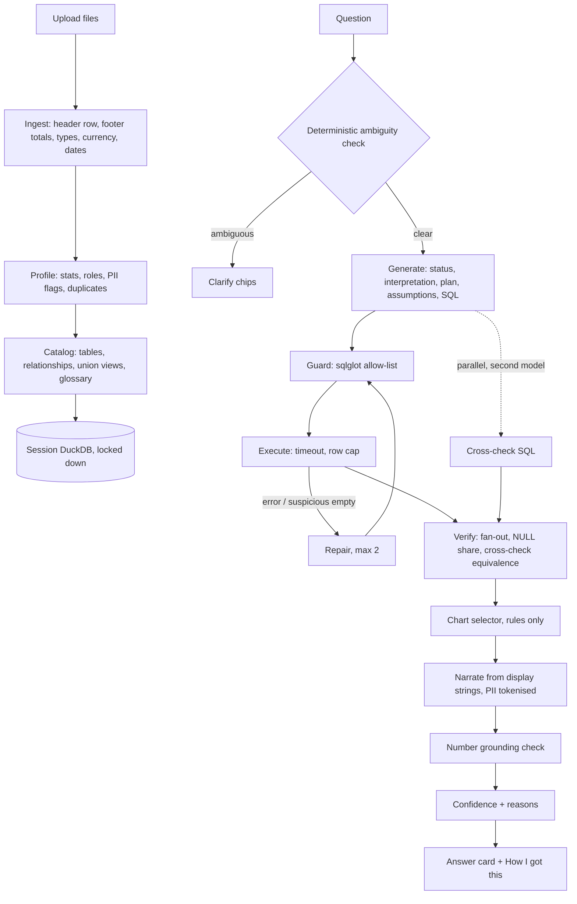
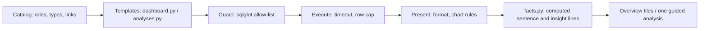

# DarwinLens — Design Spec

*Plain-English questions over messy spreadsheets, with answers you can verify.*

| | |
|---|---|
| Author | Sahil Patel |
| Date | 2026-09-20 |
| Status | Draft for approval |
| Deadline | 2026-09-21 12:00 IST (code freeze 01:00, submit by 11:30) |

## 1. What is being asked, and what is being judged

Build a small web app: upload one or more CSV/Excel files, ask analytical questions in plain English, get a **clear, correct answer**. Acceptance criteria: multi-file upload, cross-file analysis, visual insights, and **"delta solutioning on top of what AI does"**. Runtime model must be open-source. Deliverables: hosted link (or local run + recording), repo + README, one-page write-up. The panel says it is grading *scoping, decisions under constraints, and AI-assisted building*, and that "a smaller, well-thought-through app beats a sprawling, half-working one."

**Reading of "delta".** The baseline is a raw LLM call over a spreadsheet. The delta is everything an engineer adds so a customer can trust the answer on their real data: the fit-gap work an FDE does.

**Where the effort goes.** The obvious build (a chat box over DuckDB text-to-SQL, a read-only guard, a clarifying question, a handful of test questions) is table stakes: it demos well and fails quietly on real customer data. Real HR exports are messy, full of PII, and use words like "attrition" and "salary" that have precise, contested meanings. So the engineering budget goes to five things:

1. Messy Indian HR exports ingest cleanly, with a receipt.
2. PII-safe by construction, and provably so inside the UI.
3. An HR metric layer, so "attrition" means one vetted thing.
4. Catching *silent* wrong answers (fan-out, cross-check, number grounding), not only SQL errors.
5. Measured correctness, including whether the confidence badge is calibrated, visible in the app.

**Strategy: same small surface, 10x depth.** One screen: upload, ask, answer. Every visible feature works. Ambition goes under the hood and into proof.

## 2. Product thesis

> The LLM never computes a number and never sees a row. It translates intent into SQL. DuckDB computes. Deterministic code verifies. The UI shows the work.

## 3. Approaches considered

| | Approach | Verdict |
|---|---|---|
| A | **LLM writes SQL; DuckDB executes; deterministic verification around it** | **Chosen.** Auditable, fast, deterministic at temperature 0, no code execution. |
| B | LLM writes pandas/Python that is exec'd (PandasAI, LangChain CSV agent) | Rejected. Repeated RCE CVEs (CVE-2024-12366 CVSS 9.8, CVE-2023-39659/39661, CVE-2024-5565); blacklist sandboxes were bypassed twice. Not defensible for HR data. |
| C | Semantic layer only: map questions to predefined metrics | Rejected as the sole path: cannot answer ad-hoc questions on arbitrary uploads. **A slice of it is kept**: a small HR glossary of vetted definitions injected when the user's words match. |

Limits accepted with A: no statistical tests, forecasting or free-form Python. Those questions get an honest refusal.

## 4. Scope

*Revised at the end of the build day (2026-09-20, 23:00 IST). The tiers below are what actually shipped, not what was planned at 13:00. Where the plan and the code disagree, the code wins.*

**P0 — shipped, end to end**
Multi-file upload (CSV, XLSX, multi-sheet) · cleaning + profiling · per-session locked-down DuckDB · plan→SQL generation · parser guard · execution with timeout and row cap · repair loop (max 2) · deterministic chart selection · grounded narration · "How I got this" panel · streamed pipeline steps · one-click sample HR data · Docker one-command run · README. *Still open:* the deployed URL — the blueprint and the keep-warm job are written and tested, the deploy itself needs Sahil (`docs/PENDING.md`).

**P1 — the delta. All thirteen shipped.**
1. Data Health card / ingestion receipt per file
2. PII detection; schema-only prompts; PII tokenisation before narration; "What the model saw" tab; canary test
3. Relationship detection (match %, cardinality) + same-schema union views, confirm/reject
4. HR glossary (editable) + column-role detection + deterministic ambiguity chips ("salary": CTC, gross or net?)
5. Join fan-out guard, NULL/duplicate caveats
6. Cross-check with a second model family → "Cross-checked" badge or disagreement banner
7. Confidence badge with listed reasons
8. Honest refusal naming the missing data
9. Follow-up questions in context; suggested starter questions validated against the schema
10. Golden eval (40 questions, dev/holdout split) + in-app Trust Report page
11. Abuse limits: per-IP rate limit, global daily LLM budget
12. A whole-app journey, local-first: projects, previous questions and a printable saved-answers board live in the browser; the server keeps no customer data (`docs/DESIGN_SYSTEM.md` §6–7)
13. Learning the product: first-run tour, a "How DarwinLens works" explainer, "What's this?" on every trust signal

**P1.5 — not planned at 13:00, built because the day found the need**
14. **The no-AI half** (`backend/app/insights/`): an automatic Overview of computed tiles, and guided analyses (ten published, nine runnable — the tenth is an open item in `docs/PENDING.md`). No model call anywhere in it; same guard, executor, formatter and chart rules as an answer. Reasons in `DECISIONS.md` 27.
15. **Claim checking on the sentence** (`query/narrator.py`), after a live answer named the wrong department as highest with every number genuine (`DECISIONS.md` 20), plus a cross-check tolerant of rounding and a named-period check (`query/verify.py`).
16. **Computed insight lines** on answers and tiles (`insights/facts.py`, `DECISIONS.md` 28).
17. **A second, messier test set** (`test_files/`) with expected answers computed by pandas, which found the catalog bugs listed in its README.
18. **Failover with cooldowns, token pacing and a bounded wait** (`llm/client.py`), per-IP limits (`limits.py`), and the patches from an adversarial review.
19. **A never-tuned challenge set** of sixteen questions, scored separately (`DECISIONS.md` 29).
20. **The Clarity visual direction**, replacing Ledger (`DECISIONS.md` 26).

**P2 — cut, and still cut**
Export PNG · answer feedback that appends to eval candidates · "exclude duplicates" toggle · mini SVG schema diagram · **MCP endpoint over the same engine** (the strongest of these and the first thing named in `WRITEUP.md` as next). *Shipped after all:* dark mode, which came free with Clarity's token layer.

**Deliberately out (stated in the write-up)**
Auth and multi-tenancy · server-side storage of customer data (projects are saved in the browser instead) · teams, sharing and scheduled reports · warehouses other than DuckDB · fine-tuning · RAG/vector search over rows · two-row merged headers *as a feature* (a two-row header's key is now rescued, but the upper row is still discarded) · wide attendance-muster unpivot · a time/timestamp column type, so punch-to-punch durations cannot be computed · small-n salary suppression · files over 10 MB on the hosted demo (25 MB locally).

Rule: never leave a half-working feature visible. A feature that is not green by its gate is removed from the UI, not hidden behind a bug. It held: main stayed deployable all day, and what was not finished and tested was taken out rather than shipped half-working.

## 5. Architecture

### The other half: no model in the loop

The diagram above is the question path. Since 2026-09-20 there is a second path to the same
screen that calls no model at all, and it shares everything after the SQL is written:

- `backend/app/insights/dashboard.py` proposes tiles from the catalog's roles, types and links,
  runs them in waves under a 1.5 s query budget, scores what came back and keeps at most 14.
  On the bundled sample data that is 14 tiles in about 66 ms, and the same 14 every time.
- `backend/app/insights/analyses.py` publishes ten guided analyses and the columns that may fill
  each slot. No string from a request is ever interpolated into SQL: `sqlbuild.resolve` maps a
  reference to the catalog's own spelling and every option is matched against a fixed allow-list.
- Both go through `query/guard.py`, `query/executor.py` and `query/presentation.py` — the same
  code a model-written query goes through — so a tile and an answer cannot disagree about a
  number. `insights/facts.py` writes the sentence and the insight lines, and the query pipeline
  calls the same function, so an answer carries the reading a tile would have carried.
- `backend/app/insights/routes.py` holds no model client. These routes spend no tokens and are
  therefore outside the question budget; they are inside no other limit either, which is an open
  item in `docs/PENDING.md`.

- **Backend:** Python 3.12, FastAPI, DuckDB 1.5, pandas + openpyxl, sqlglot, Pydantic v2, `openai` client against any OpenAI-compatible base URL. Managed with `uv`.
- **Frontend:** React + Vite + TypeScript + Tailwind + Recharts. No state library, no router, no component kit. Native `
` for collapsibles, `Intl.NumberFormat('en-IN')` for ₹ lakh/crore.
- **Packaging:** one Dockerfile; FastAPI serves the built SPA; listens on `$PORT`.
- **State:** in-memory sessions (LRU 20, TTL 2 h), single worker. Session id travels in a header, not a cookie.

### LLM call budget per question

| Call | Model role | When |
|---|---|---|
| generate | primary SQL model, strict JSON schema, temperature 0 | always |
| cross-check | second model family, same prompt, only its SQL is used | in parallel, when configured |
| repair | primary | only on failure, max 2 |
| narrate | small fast model | always; a deterministic template is the fallback when grounding fails |

Identical question + identical catalog version returns the cached answer, flagged as cached. This makes answers repeatable and the demo robust. A process-level cache keyed by dataset fingerprint lets the sample-data starter questions be pre-warmed after each deploy (`make warm`).

## 6. Components

Each module has one purpose, a typed interface in `contracts.py`, and its own tests.

### 6.1 Ingest (`backend/app/ingest`)
Reads everything as text first, then infers types itself, so `000457` stays an ID.
- CSV: encoding and delimiter sniffing. Excel: every non-empty sheet becomes a table.
- **Header row detection:** score the first 15 rows (non-null ratio, all-string, uniqueness); rows above are reported as skipped title rows.
- **Footer totals:** trailing rows whose first text cell matches `total|grand total` are dropped and reported (they double-count if summed).
- **Type inference (≥95% of non-null values must parse):** integers, decimals, percentages, booleans, dates, currency. Currency: `₹ 12,34,567.00`, `1.2L`, `12.5 lakh`, `3 Cr`, bracketed negatives. Dates: DD/MM/YYYY, DD-MM-YYYY, DD-MMM-YY, ISO, Excel serials; day-first is decided from evidence (any day > 12), defaulting to day-first with a caveat when undecidable. Null tokens: empty, `-`, `NA`, `N/A`, `null`, `nil`. Values that fail to parse become NULL and are counted in the receipt (the mixed-type case).
- Whitespace trimmed; column names normalised to snake_case with the original kept as a label.
- **Duplicates:** exact full-row duplicates are excluded only when the table has an identifier column (identical including the ID means an export error); otherwise flagged and kept. Always reported, and surfaced as a caveat on answers that touch the table.
- Output: cleaned DataFrame + `DataHealth` (rows, columns, skipped rows, dropped totals, coercions, unparseable counts, date format, duplicates, null hot-spots, PII columns, preserved IDs).

### 6.2 Profile (`backend/app/profile`)
- Per column: type, null %, distinct count, min/max, uniqueness, and the **true distinct values only for non-PII columns with ≤ 30 distinct values** (the model needs real filter literals such as `Bengaluru`; research shows this is the single highest-gain technique). Values are length-capped and passed as JSON data.
- **PII detection:** regex for email, Indian mobile, PAN, Aadhaar, UAN, bank account/IFSC, plus header heuristics for names. PII and high-cardinality text columns contribute no values to any prompt, only a shape description.
- **Role detection:** header-synonym dictionary maps columns to roles (`employee_id`, `join_date`, `exit_date`, `ctc`, `gross`, `net`, `department`, `gender`, `rating`, …). Roles drive the glossary and ambiguity checks.

### 6.3 Catalog (`backend/app/catalog`)
- **Relationships:** candidate pairs are identifier-like or name-similar columns of compatible type across tables; overlap is measured in DuckDB in both directions; cardinality (1:1, 1:N, N:M) comes from key uniqueness. ≥ 80% match is active by default, lower is suggested; the user can confirm or reject either.
- **Unions:** tables with the same normalised columns and compatible types get a view (`attendance_all`) with a `source_file` column, active by default, rejectable.
- **Glossary:** seeded HR metrics, each with synonyms, a plain definition, required roles and a SQL pattern: headcount as of a date, attrition rate (exits ÷ average headcount; annualised as monthly × 12, stated), early attrition, average tenure, gender ratio, absenteeism rate, LOP %, average CTC, rating distribution, span of control, Indian fiscal year (FY26 = Apr 2025–Mar 2026). Editable per session. If a metric's required roles are absent, the answer is a refusal that names the missing column.
- **Prompt context builder:** the only code allowed to assemble what the model sees. One choke point makes the no-raw-rows guarantee testable.

### 6.4 Session store (`backend/app/sessions.py`)
One `duckdb.connect(":memory:")` per session. At creation: `threads=2`, `memory_limit`, dedicated `temp_directory`, extension auto-install/auto-load off, community extensions off, then `enable_external_access=false`, then `lock_configuration=true` (order matters; both are one-way). Verified on DuckDB 1.5.5: uploads still load after lock-down through `con.register()`, while file readers, URLs, COPY, ATTACH of files, INSTALL and LOAD are blocked. CREATE/INSERT are *not* blocked by DuckDB, which is why the parser guard is mandatory.

### 6.5 Query pipeline (`backend/app/query`)
1. **Ambiguity (deterministic):** if a glossary term maps to more than one role present in the data and the question names none, return clarify chips. The model may also return `clarify`, honoured only if its options map to real columns. Default elsewhere is to state the assumption rather than interrogate the user.
2. **Generate:** one structured call returning `{status: ok|clarify|unanswerable|meta, interpretation, plan[], assumptions[], sql, clarify?, missing?}`. Context: schema, stats, allowed distinct values, active relationships with cardinality, union views, matched glossary entries, 6 static DuckDB few-shots, last 3 turns (question, interpretation, SQL; never results). No schema pruning: research shows it hurts when the schema fits in context. `meta` questions ("what data do I have?") are answered from the catalog by template.
3. **Guard:** `sqlglot` parse as DuckDB → exactly one statement → `Select`/set operation only → no write or command nodes → no table functions (blocks `read_csv`, `query()`, `duckdb_settings()`) → no qualified names (blocks `information_schema`) → every real table in the catalog (CTEs resolved by scope) → deny-listed functions rejected → columns resolved against the schema, with closest-match suggestions for hallucinated ones (`difflib`). Allow-list design; tested against a hostile-query corpus.
4. **Execute:** cursor per query, `threading.Timer` → `interrupt()` for timeout, `fetchmany(cap + 1)` to detect truncation.
5. **Repair:** DuckDB error or suspicious empty result goes back with the schema; max 2; every attempt logged and shown.
6. **Verify:** (a) fan-out: for each equality join, look up key uniqueness; N:M joins, or aggregating a measure from the "one" side of a 1:N join, trigger one repair asking for pre-aggregation, then a caveat and lower confidence; (b) NULL share of filtered and aggregated columns becomes a caveat; (c) cross-check: execute the second model's SQL and compare result sets as multisets, ignoring column names and order, with numeric tolerance. Agreement earns the badge; disagreement shows a banner with both numbers and lowers confidence. Research shows voting adds little accuracy but is the best available confidence signal, which is how it is used.
7. **Chart selector (rules, never the model):** one value → KPI tile; date + measure → line; category (≤ 12) + measure → sorted bar; more categories → top 12 + note + table; two categories + measure → grouped bar; two measures → scatter; otherwise table. Chart/table toggle always available. The response carries a JSON chart spec, never code.
8. **Narrate:** the model receives the question, the SQL and the result with every number pre-formatted as a display string (`₹12.4 L`) and every PII value replaced by a token (`⟦P1⟧`), rehydrated server-side. It returns the answer, a one-line reading of the SQL in English (back-translation, shown as "How I read your question"), and three follow-ups. Rendered as plain text only: no markdown, links or images.
9. **Grounding check:** every numeric token in the narration must be a provided display string, a raw result value, the row count, or a number from the question. One regeneration, then a templated answer. Mangled PII tokens also trigger the template.
10. **Confidence:** High/Medium/Low from listed signals: repairs used, cross-check outcome, NULL share, join match rate, fan-out flag, narration fallback, vetted definition used. The reasons are shown, not just the badge.

### 6.6 API (`backend/app/main.py`)
`POST /api/sessions` · `POST /api/sessions/{id}/files` (multipart, many) · `POST /api/sessions/{id}/sample` · `GET /api/sessions/{id}/catalog` · `PATCH /api/sessions/{id}/links/{link_id}` · `GET|PUT /api/sessions/{id}/glossary` · `POST /api/sessions/{id}/ask` (streams step events, then one `answer | clarify | refusal | error` event) · `GET /api/eval/report` · `GET /healthz`.
Streaming is SSE over the POST response, read with `fetch`; headers `Cache-Control: no-cache`, `X-Accel-Buffering: no`, 15 s heartbeat, no gzip on the stream. Uploads stream to disk with a size cap. Per-IP rate limit and a global daily LLM-call budget protect the API key on a public URL; a hard spend cap is also set at the provider.

### 6.7 Frontend (`frontend/`)
- **Landing:** drop zone and "Try with sample HR data". Goal: a first-time user gets a correct charted answer in under 30 seconds.
- **Sidebar:** file cards with Data Health receipts; relationships and unions with match %, cardinality, confirm/reject; editable glossary. Collapses to a drawer on mobile.
- **Thread:** answer card leads with the number, unit and period; then chart/table toggle; confidence badge with reasons; caveats; follow-up chips. "How I got this" holds: reading of the question, plan, data used and rows scanned, assumptions, SQL (collapsed), attempts, and **What the model saw** (the exact prompts).
- **Header:** "Your rows never reach the model" shield with an explainer; link to the **Trust Report**.
- States: skeletons, streamed step list instead of a spinner, human error messages with a next step, Enter to submit.

### 6.8 Security model

| Threat | Control |
|---|---|
| Destructive or exfiltrating SQL | Allow-list parser guard + locked-down DuckDB (defence in depth) |
| Runaway query | Timeout via interrupt, row cap, memory limit, 2 threads |
| PII reaching a third-party model | Single prompt-builder choke point; PII columns contribute no values; result PII tokenised before narration; canary test over every payload |
| Prompt injection in cell values or headers | Cell text never enters the generate prompt except capped low-cardinality categories passed as JSON data; narrator has no tools; plain-text rendering; grounding check; tested |
| Hallucinated numbers | Model copies display strings; grounding check; templated fallback |
| Key abuse on a public demo | Per-IP limit, global daily budget, provider spend cap, upload cap |

## 7. Models and hosting (checked against provider docs on 2026-09-20)

**Constraint chosen: strictly $0, no credit card.** That rules out any single provider: Groq free is 8K tokens/min and 200K tokens/day per model (one eval run is ~360K); Cerebras needs a card; OpenRouter free is 50 requests/day; Groq retired `llama-3.3-70b-versatile` on 2026-08-16. So reliability comes from engineering instead of spend:

- **Provider pool with failover.** An ordered list in env (`LLM_PROVIDERS`), each entry `{base_url, api_key, model, role}`. A 429 or 5xx moves to the next provider and respects `retry-after`; the chosen provider and model are recorded in the answer's trace. Pool: NVIDIA NIM `deepseek-ai/deepseek-v4-flash-0731` (MIT), Groq free `openai/gpt-oss-120b`, `qwen/qwen3.8-27b` and `openai/gpt-oss-20b` (Apache-2.0; limits are per model, so three models are three budgets), Google AI Studio `gemma-4-31b-it` (Apache-2.0), OpenRouter `:free` models as last resort. All are open-weight under OSI-approved licences.
- **Lean prompts.** The generate prompt is budgeted at ≤ 2K tokens (compact schema format, 6 short few-shots) so Groq's 8K tokens/min still allows several questions a minute.
- **Disk-backed LLM response cache** keyed by model + messages, used by the eval runner so a prompt change only re-spends the calls it actually changed. The eval loop re-runs failing questions first and does a full confirmation run at the end. Cross-check is on for final runs and the live app, off during tuning iterations.
- **The golden eval picks the primary model**; the comparison table goes in the README. The cross-checker is a different family from the primary. Narration uses the smallest fast model available.
- Naming note for the README: gpt-oss is OpenAI's Apache-2.0 open-weight release served by Groq, not the GPT API. Reasoning output is set to hidden/parsed so `<think>` blocks never break JSON.
- Fully local option documented: Ollama with the same env vars.
- **Hosting:** Hugging Face now requires PRO ($9/mo) to create a Docker Space and Fly.io needs a card, so the host is **Render free** (512 MB, 0.1 CPU, sleeps after 15 idle minutes, ~1 minute wake). Mitigations: keep-warm ping every 10 minutes (GitHub Actions cron plus an uptime monitor), 10 MB upload cap on the hosted demo, 2 DuckDB threads and a 256 MB memory limit, pre-warmed starter answers. Railway's card-free trial is tried at deploy time as an always-on alternative; the image is host-agnostic (`$PORT`). A 3-minute demo video ships regardless, and `docker compose up` runs the full-size app locally.

## 8. Demo data and golden eval

**Demo data (`demo_data/`, seeded generator).** Indian company, ~500 employees: `employees.csv` (codes with leading zeros, DD/MM/YYYY joins, nullable exits, PII columns), `Salary_Register_2025.xlsx` (merged title rows, Grand Total footer, ₹ strings, `Emp Code` vs `emp_id`, second sheet `Bonuses`), `attendance_q1.csv` + `attendance_q2.csv` (same schema), `performance_reviews.xlsx`, and `sales.csv` to prove generality. Injected mess: duplicates, nulls, trailing spaces, one mixed-type column, one cell containing a prompt-injection string, canary PII values. All data is synthetic and says so.

**Ground truth is independent of the app.** It is computed with pandas from the generator's clean frames *before* the mess is injected, so the eval tests ingestion and SQL together.

**Golden set (`eval/golden.yaml`), 40 questions:** totals, averages, filters, comparisons, trends, cross-file joins, unions, HR metrics, fiscal-year logic, a fan-out trap, a NULL trap, ambiguous (expect chips or a stated assumption), unanswerable (expect refusal naming the gap), injection (expect no effect). **30 dev / 10 holdout**: the tuning loop sees holdout scores but never holdout failures, so prompt tuning cannot overfit.

**Comparison:** rows as a multiset; column names and order ignored; gold columns must be a subset of predicted; relative tolerance 1e-6 after rounding rules.

**Report (`eval/report.json`, `eval/REPORT.md`, and the in-app Trust Report):** accuracy overall, per category and on holdout; trust score (+1 correct, 0 abstain, −1 wrong); p50/p95 latency; repair rate; cross-check agreement; **confidence calibration** (accuracy within High, Medium, Low); model comparison; honest failures listed. Target ≥ 90% on dev with holdout within 10 points; final numbers from 3 runs (mean and all-3-pass). What changed between iterations is logged in `DECISIONS.md`.

## 9. Testing

- **Unit (pytest):** header/footer detection, currency and date parsing, type inference thresholds, duplicates policy, PII detectors, role detection, relationship and union detection, guard (hostile corpus), executor timeout and cap, fan-out detection, result-set equivalence, chart rules, grounding check, PII token round trip, confidence. LLM calls are faked through one `LLMClient` protocol with a `FakeLLM`.
- **Guarantee tests:** canary (planted PII never appears in any prompt payload), prompt injection in a cell has no effect, no number in an answer outside the result set.
- **Adversarial:** empty file, header-only file, 300-column file, unicode headers, 25 MB file, SQL-injection phrasing.
- **End to end:** one Playwright smoke test (sample data → ask → chart → open "How I got this"); golden eval against the real model.
- **CI:** GitHub Action running pytest and the frontend build.

## 10. Build plan

**Team.** The Lead (Claude Code main loop) owns contracts, integration, review and gates. Subagent definitions live in `.claude/agents/`. Agents own disjoint directories, code against frozen contracts, do not add dependencies or run git, and report what was built, tested and risky. The Lead commits per module with clear messages. How the team was run is documented in `docs/AI_WORKFLOW.md` because AI-assisted building is part of what is graded.

| Agent | Owns |
|---|---|
| data-engine | `ingest`, `profile`, `catalog`, `sessions` + tests |
| ai-pipeline | `llm`, `query` + tests |
| frontend | `frontend/` against contract fixtures |
| qa-eval | `demo_data/`, `eval/`, adversarial corpus, Playwright |
| devops-docs | Dockerfile, compose, Makefile, Render config, CI, README skeleton |

| Phase | Clock (IST) | Work | Gate |
|---|---|---|---|
| 0 | 13:15–14:00 | Lead: scaffold, `contracts.py` + `types.ts`, module signatures, fixtures, `CLAUDE.md`, `DECISIONS.md`, `.env.example`, locked deps | Contracts committed |
| 1–2 | 14:00–16:30 | **Workflow 1:** five builders in parallel, each followed by an independent reviewer that runs the tests and tries to break the module | All module tests green |
| Integrate | 16:30–17:30 | Lead: wire routes, pipeline and UI; run with the real model | Sample data → question → chart works locally |
| Deploy early | 17:30–18:15 | Docker build, deploy, `make warm` | Public URL works with sample data |
| 3 | 18:15–21:30 | Finish P1 layers; **Workflow 2: eval loop** (run → classify failures → minimal fix → re-run) until dev ≥ 90%, max 6 iterations; model A/B | Eval target met, tests green |
| 4 | 21:30–23:30 | **Workflow 3: adversarial hardening** (guard bypass, PII canary, injection, UX walkthrough with screenshots), polish, P2 if time | No open high-severity finding |
| 5 | 23:30–01:00 | README, WRITEUP (1 page), DEMO_SCRIPT, AI_WORKFLOW, final deploy + warm | **Code freeze 01:00** |
| Submit | 09:00–11:30 | Sahil records the 3-minute video, final smoke check, submit | Sent by 11:30 |

After every phase: all tests, run the app, fix regressions, update `DECISIONS.md`, commit, push.

**Sahil is needed at three points:** now (free API keys), about 17:30 (connect the repo on Render), and the morning (video, submit). Everything else runs unattended.

## 11. Risks

| Risk | Mitigation |
|---|---|
| Free-tier rate limits or a provider outage during evaluation | Multi-provider failover pool, lean prompts, answer cache, pre-warmed starter questions, demo video as the last line |
| Cold start on the free host | Keep-warm pings from two sources; video and local Docker run documented |
| Model retired at short notice (Groq preview models) | Everything in env vars; primary is a production model |
| Eval overfitting | Holdout split; holdout failures hidden from the tuning loop |
| Parallel agents colliding | Disjoint directories, frozen contracts, no agent-side git, locked deps |
| Time overrun | P2 cut first, then P1 from the bottom; visible-but-broken features are removed |
| 512 MB on the fallback host | Lower upload cap, 2 threads, memory limit |
| Public key abuse | Rate limits, daily budget, provider spend cap |

## 12. Decisions seeded into `DECISIONS.md`

SQL over code execution · DuckDB in-memory per session, locked down after creation · allow-list guard, not deny-list · read-as-text then infer types · true distinct values only for low-cardinality non-PII columns · deterministic ambiguity before model-judged ambiguity · rules choose charts · model copies display strings · cross-check used as a confidence signal, not a vote · duplicates policy · no schema pruning · dev/holdout eval split · SSE over POST · header session ids · $0 constraint answered with a failover pool rather than a paid tier · Render free with keep-warm over paid always-on hosts · model chosen by eval, not by reputation.
